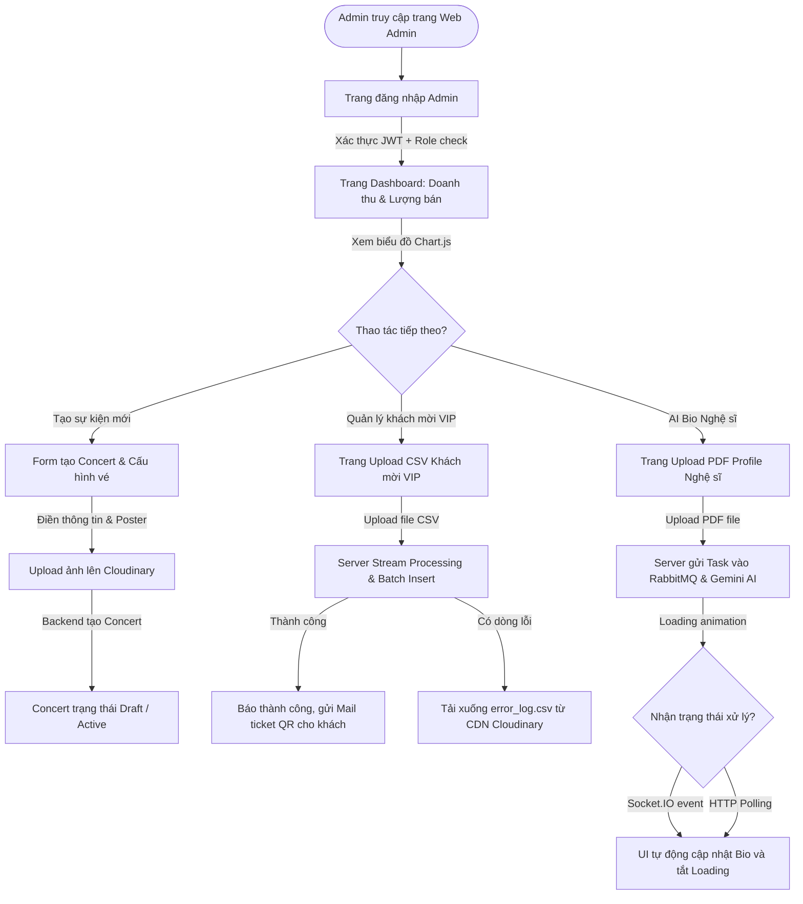

# Web Admin Portal Specifications — Admin Tools Spec

Tài liệu này đặc tả kiến trúc giao diện, luồng người dùng (User Flow), giải pháp kỹ thuật và đặc tả API phía Web Admin Portal dành cho Ban tổ chức (BTC) của hệ thống bán vé chịu tải cao **TicketBox**.

---

## 1. Tổng quan & Luồng đi của Admin (User Flow)

Phân hệ Web Admin Portal được thiết kế dành riêng cho Ban tổ chức để quản trị các concert, theo dõi doanh thu thời gian thực và quản lý tập khách mời VIP. Giao diện được xây dựng bằng **React.js (Vite + TypeScript)** kết hợp **CSS Vanilla** và thư viện **Chart.js** để vẽ biểu đồ doanh thu.

### Sơ đồ luồng đi của Admin (User Flow Diagram)



---

## 2. Đặc tả các trang giao diện (Page Specifications)

### Trang 1: Dashboard Thống kê (Doanh thu & Lượng vé bán)
*   **Chức năng chính:** Giúp BTC theo dõi trực quan doanh số và lượng vé đã bán ra của từng concert.
*   **Chi tiết giao diện:**
    *   **Thẻ chỉ số (Metrics Cards):** Tổng doanh thu (VNĐ), Tổng số vé bán ra, Tỷ lệ lấp đầy (%), Tổng số lượng khách VIP đã check-in.
    *   **Biểu đồ doanh thu (Revenue Chart):** Biểu đồ đường (Line Chart) biểu diễn biến động doanh số theo thời gian (giờ/ngày).
    *   **Biểu đồ lượng vé (Ticket Sales Chart):** Biểu đồ cột chồng (Stacked Bar Chart) thể hiện số lượng vé bán ra của từng phân hạng (SVIP, VIP, GA).

---

### Trang 2: Form Tạo Concert mới
*   **Chức năng chính:** Thiết lập thông tin concert và cấu hình các hạng vé.
*   **Chi tiết giao diện:**
    *   **Thông tin chung:** Tên concert, Mô tả, Địa điểm, Thời gian bắt đầu, Thời gian kết thúc.
    *   **Upload Poster:** Hộp kéo thả file ảnh (.png, .jpg). Ảnh được upload trực tiếp lên Cloudinary CDN thông qua backend.
    *   **Cấu hình Phân hạng vé (Dynamic Fields):** 
        *   Nút "Thêm phân hạng" cho phép tạo nhiều phân hạng (SVIP, VIP, GA, CAT1...).
        *   Các trường nhập cho mỗi hạng vé: Tên hạng vé, Giá vé (VNĐ), Tổng số lượng vé phát hành, Số lượng mua tối đa trên mỗi tài khoản (`maxPerUser`, mặc định = 2).

---

### Trang 3: Trang Upload CSV Khách mời VIP
*   **Chức năng chính:** Import hàng loạt danh sách khách VIP để hệ thống tự sinh mã QR vé điện tử gửi qua Email.
*   **Chi tiết giao diện:**
    *   Khu vực chọn Concert cần import khách mời.
    *   Hộp kéo thả tệp tin hỗ trợ định dạng `.csv`. Link tải tệp CSV mẫu (`template_guest.csv`).
    *   Nút bấm "Bắt đầu Import".
    *   **Vùng hiển thị trạng thái (Status Panel):** 
        *   Hiển thị thanh tiến trình (Progress Bar) chạy thực tế (ví dụ: `Đang import: 450/1000 khách...`).
        *   Báo cáo kết quả: Số dòng import thành công (Ví dụ: `Thành công: 980 dòng`), Số dòng lỗi (Ví dụ: `Thất bại: 20 dòng`).
        *   Nút bấm nổi bật **"Tải file báo cáo lỗi"** (chỉ hiển thị khi số dòng lỗi > 0) để BTC sửa lại và import lại.

---

### Trang 4: Trang Upload PDF Profile Nghệ sĩ (Gemini AI Bio)
*   **Chức năng chính:** Tải lên tệp PDF Press Kit/Hồ sơ nghệ sĩ để Gemini AI tự động tóm tắt và cập nhật vào trang giới thiệu concert.
*   **Chi tiết giao diện:**
    *   Khu vực chọn Concert tương ứng của nghệ sĩ.
    *   Hộp kéo thả tệp tin hỗ trợ định dạng `.pdf` (kích thước tối đa 10MB).
    *   **Hiệu ứng Real-time Loading:** 
        *   Khi bấm "Bắt đầu xử lý bằng AI", màn hình sẽ hiện hiệu ứng xoay (Loading Spinner) hoặc thanh tiến trình kèm thông tin: *"Hệ thống đang trích xuất văn bản PDF và phân tích bằng AI Gemini..."*.
        *   Khi hoàn tất, hiệu ứng loading biến mất và đoạn văn bản tóm tắt tiểu sử nghệ sĩ sẽ tự động hiển thị ra màn hình để Admin duyệt trước khi Active sự kiện.

---

## 3. Các quyết định kỹ thuật Web Admin (Technical Specs)

### 3.1. Giải pháp nhận phản hồi trạng thái Real-time
*   **Các phương án cân nhắc (Options):**
    *   *Option A (Chỉ dùng HTTP Short Polling):* Client định kỳ mỗi 3 giây gửi request `GET /api/v1/concerts/:id` kiểm tra trạng thái `processingBio`. Khi `processingBio = false`, UI sẽ tự động reload lấy dữ liệu mới.
    *   *Option B (Dùng WebSocket - Socket.IO):* Client kết nối tới cổng WebSocket Gateway của server. Khi backend/worker xử lý AI hoặc import CSV xong, server sẽ bắn một sự kiện WebSocket trực tiếp về client (ví dụ: `guest_imported` hoặc `ai_bio_completed`).
*   **Đánh giá:**
    *   *Ưu điểm Option A:* Cực kỳ dễ triển khai ở cả frontend và backend, không tốn tài nguyên duy trì kết nối Socket.
    *   *Nhược điểm Option A:* Tạo ra lượng request lớn không cần thiết lên server dưới dạng truy vấn cơ sở dữ liệu liên tục.
    *   *Ưu điểm Option B:* Tốc độ phản hồi tức thì, tối ưu hóa băng thông mạng, trải nghiệm người dùng rất cao.
    *   *Nhược điểm Option B:* Cần cài đặt thêm thư viện Socket.IO Client ở React và cấu hình Socket.IO Gateway ở NestJS backend (code hiện tại của backend chưa cài đặt Gateway này).
*   **Quyết định (Decision):** **Chọn Option A (HTTP Short Polling) làm phương án triển khai mặc định** do backend hiện tại chưa cài đặt Socket.IO, nhưng **thiết kế sẵn giao thức cho Option B (WebSocket)** để dễ dàng tích hợp khi backend bổ sung module Gateway sau này.
*   **Lý do phù hợp với hệ thống TicketBox:** Giải pháp Polling kết hợp dữ liệu cache giúp triển khai nhanh chóng, an toàn, giảm độ phức tạp vận hành của hệ thống trong giai đoạn đầu.

---

### 3.2. Luồng xử lý và Validate tệp CSV Khách mời VIP
*   **Các phương án cân nhắc (Options):**
    *   *Option A (Validate Client-side):* React sử dụng JavaScript đọc tệp CSV, validate định dạng email, số điện thoại, tên phân khu trước khi đẩy file lên server.
    *   *Option B (Upload file thô + Server Stream & Batch Insert + Trả về file lỗi):* Client upload file thô lên API. Server sử dụng cơ chế xử lý dòng chảy (Stream) đọc từng chunk 500 dòng, validate nghiệp vụ cơ sở dữ liệu trực tiếp, batch insert các dòng hợp lệ. Gom các dòng lỗi vào file log lỗi trả về URL cho Client.
*   **Đánh giá:**
    *   *Ưu điểm Option A:* Báo lỗi ngay lập tức cho người dùng mà không tốn tài nguyên mạng và CPU của server.
    *   *Nhược điểm Option A:* Không thể validate các ràng buộc nghiệp vụ phụ thuộc database (ví dụ: Kiểm tra email này đã được import VIP trước đây chưa, phân hạng vé VIP có khớp với concert_id được cấu hình trong DB không).
    *   *Ưu điểm Option B:* Đảm bảo tính toàn vẹn dữ liệu 100%, chống tràn bộ nhớ (RAM) của server khi upload file CSV có hàng chục nghìn dòng, trả về báo cáo lỗi chi tiết cho BTC.
    *   *Nhược điểm Option B:* Đòi hỏi logic tạo và lưu trữ tệp tin lỗi phức tạp hơn ở server.
*   **Quyết định (Decision):** **Chọn Option B.**
*   **Lý do phù hợp với hệ thống TicketBox:** Đảm bảo tính nhất quán của cơ sở dữ liệu và tuân thủ nguyên tắc xử lý Stream/Chunk đối với tệp tin lớn của backend.

---

### 3.3. Thư viện vẽ biểu đồ Dashboard
*   **Các phương án cân nhắc (Options):**
    *   *Option A (Chart.js):* Vẽ biểu đồ dựa trên HTML5 Canvas. Rất nhẹ, hiệu năng cực cao khi render dữ liệu biến động lớn.
    *   *Option B (Recharts / D3.js):* Thư viện vẽ biểu đồ dựa trên React Components (SVG-based).
*   **Đánh giá:**
    *   *Ưu điểm Option A:* Hiệu năng vẽ Canvas vượt trội so với SVG khi lượng điểm dữ liệu thống kê lên tới hàng nghìn điểm. Tài liệu hướng dẫn sử dụng đa dạng.
    *   *Nhược điểm Option A:* Khó viết responsive hơn vì Canvas yêu cầu cập nhật lại kích thước trực tiếp bằng JavaScript.
    *   *Ưu điểm Option B:* Dễ tạo responsive bằng CSS thông thường, tích hợp sâu vào hệ sinh thái React.
    *   *Nhược điểm Option B:* File bundle size lớn, hiệu năng render SVG giảm mạnh dưới tải dữ liệu lớn.
*   **Quyết định (Decision):** **Chọn Option A (Chart.js).**
*   **Lý do phù hợp với hệ thống TicketBox:** Đáp ứng trực tiếp yêu cầu trong phân chia công việc của thành viên 3.

---

## 4. API Request/Response đặc tả cho Client (Admin Portal)

### 4.1. API Upload danh sách Khách mời VIP từ CSV
*   **Endpoint:** `POST /api/v1/concerts/:id/guest-list`
*   **Content-Type:** `multipart/form-data`
*   **Request Headers:**
    *   `Authorization: Bearer <jwt_token>` (Role của User bắt buộc là `BAN_TO_CHUC` hoặc `ADMIN`)
*   **Request Body (Form Data):**
    *   `file`: File CSV chứa danh sách (dung lượng tối đa 5MB)
*   **Response Body (Trường hợp xử lý thành công toàn bộ):**
```json
{
  "importId": "018f2b84-5e6f-7f4c-9c34-223344556677",
  "fileName": "vip_guest_list_sayhi.csv",
  "totalRows": 1000,
  "successRows": 1000,
  "failedRows": 0,
  "errorLogUrl": null,
  "message": "Import danh sách khách mời VIP thành công. Đã gửi Email kèm vé QR."
}
```
*   **Response Body (Trường hợp có dòng lỗi):**
```json
{
  "importId": "018f2b84-5e6f-7f4c-9c34-223344556677",
  "fileName": "vip_guest_list_sayhi.csv",
  "totalRows": 1000,
  "successRows": 950,
  "failedRows": 50,
  "errorLogUrl": "https://res.cloudinary.com/ticketbox/raw/upload/v1717231200/errors/error_log_5e6f.csv", // Đường dẫn tải file log lỗi
  "message": "Import hoàn tất. Phát hiện 50 dòng bị lỗi định dạng. Vui lòng tải file error_log.csv để kiểm tra."
}
```

#### Quy tắc Validation cho tệp CSV:
Mỗi dòng trong file CSV phải được Server validate theo quy tắc:
*   `FullName`: Bắt buộc, chuỗi không rỗng, độ dài tối đa 100 ký tự.
*   `Email`: Bắt buộc, đúng định dạng email tiêu chuẩn.
*   `Phone`: Bắt buộc, đúng định dạng số điện thoại Việt Nam (10 chữ số).
*   `TicketType`: Bắt buộc, phải là một trong các hạng vé tồn tại trong Concert đó (ví dụ: `SVIP`, `VIP`, `GA`).

---

### 4.2. API Upload PDF Nghệ sĩ để sinh AI Bio
*   **Endpoint:** `POST /api/v1/concerts/:id/artist-bio`
*   **Content-Type:** `multipart/form-data`
*   **Request Headers:**
    *   `Authorization: Bearer <jwt_token>`
*   **Request Body (Form Data):**
    *   `file`: Tệp tin PDF Press Kit nghệ sĩ (dung lượng tối đa 10MB).
*   **Response Body (Trả về tức thì 202 Accepted):**
```json
{
  "concertId": "018f2b84-1d8f-7f3c-8a21-998877665544",
  "status": "processing",
  "message": "Tệp PDF hồ sơ nghệ sĩ đã được tải lên thành công. Hệ thống đang tiến hành trích xuất và tóm tắt bằng AI. Kết quả sẽ tự động hiển thị sau ít phút."
}
```

#### Quy tắc Validation cho tệp PDF:
*   Định dạng file bắt buộc phải là `.pdf`.
*   Dung lượng file tối đa là 10MB.
*   Chỉ chấp nhận file PDF chứa nội dung văn bản (đọc được text thô), không chấp nhận file PDF scan dạng ảnh không có OCR.

---

### 4.3. API Lấy dữ liệu biểu đồ Dashboard
*   **Endpoint:** `GET /api/v1/admin/dashboard/statistics?concertId=:id`
*   **Request Headers:**
    *   `Authorization: Bearer <jwt_token>`
*   **Response Body (Định dạng JSON):**
```json
{
  "summary": {
    "totalRevenue": 15200000000.00,
    "totalTicketsSold": 4500,
    "capacityRate": 85.50,
    "vipCheckInCount": 180
  },
  "revenueTimeline": [
    { "time": "2026-04-01T00:00:00Z", "amount": 2500000000.00 },
    { "time": "2026-04-02T00:00:00Z", "amount": 5500000000.00 },
    { "time": "2026-04-03T00:00:00Z", "amount": 8200000000.00 },
    { "time": "2026-04-04T00:00:00Z", "amount": 12000000000.00 },
    { "time": "2026-04-05T00:00:00Z", "amount": 15200000000.00 }
  ],
  "ticketTypeSales": [
    { "name": "SVIP", "sold": 450, "total": 500 },
    { "name": "VIP", "sold": 850, "total": 1000 },
    { "name": "GA", "sold": 3200, "total": 4500 }
  ]
}
```
