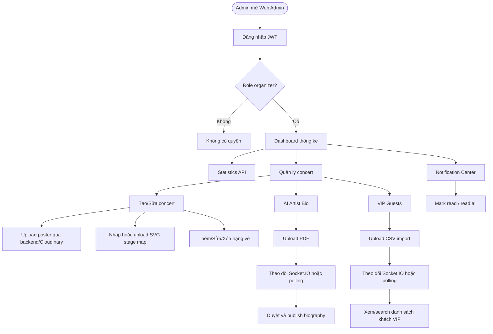

# Web Admin Portal Specifications - Current Implementation

Tài liệu này mô tả Web Admin Portal của TicketBox theo code hiện tại trong `src/frontend` và backend NestJS hiện có. Trọng tâm là các luồng đã có API thật để demo: dashboard thống kê, quản lý concert, ticket types, upload poster/SVG, AI Artist Bio, VIP guest import và notification realtime.

---

## 1. Tổng quan & User Flow

Admin đăng nhập bằng JWT, được route guard kiểm tra role `organizer`, sau đó truy cập khu quản trị.

---

## 2. Page Specifications

### 2.1. Dashboard

Dashboard hiện tại lấy số liệu vận hành thật từ module Statistics mới của backend.

- Gọi `GET /statistics/overview` để hiển thị tổng concert, concert `active`, concert `draft`, tổng vé phát hành, vé đã bán/giữ, tỷ lệ lấp đầy, tổng doanh thu và check-in.
- Gọi `GET /statistics/revenue?period=day` để hiển thị xu hướng doanh thu gần đây.
- Gọi `GET /concerts?page=1&limit=100` để lấy danh sách sự kiện gần đây.
- Gọi `GET /statistics/concerts/:id` cho từng concert cần hiển thị tiến độ bán vé và doanh thu theo concert.
- Nếu một request thống kê chi tiết concert lỗi, dashboard vẫn hiển thị các dữ liệu còn lại và cảnh báo số concert không tải được thống kê.
- Frontend không gọi endpoint cũ `GET /admin/dashboard/statistics`.

### 2.2. Concert Management

Trang `/admin/concerts` cho phép:

- Xem danh sách concert.
- Lọc client-side theo trạng thái: tất cả, `active`, `draft`, `cancelled`.
- Tạo concert bằng `POST /concerts`.
- Cập nhật concert bằng `PATCH /concerts/:id`.
- Xóa concert bằng `DELETE /concerts/:id`.
- Upload poster bằng `POST /concerts/upload-poster`.
- Nhập hoặc upload file `.svg`, đọc nội dung bằng File API và gửi trong trường `svgStageMap`.
- Quản lý ticket types:
  - Tạo: `POST /concerts/:concertId/ticket-types`
  - Cập nhật: `PATCH /ticket-types/:id`
  - Xóa: `DELETE /ticket-types/:id`

### 2.3. AI Artist Bio

Trang `/admin/concerts/:id/bio` cho phép:

- Upload PDF artist profile bằng `POST /concerts/:id/artist-bio`.
- Xem trạng thái bằng `GET /concerts/:id/artist-bio`.
- Nhận realtime notification qua Socket.IO event `notification_received`.
- Fallback polling 3 giây/lần khi job đang `processing`.
- Regenerate bio bằng `POST /concerts/:id/artist-bio/regenerate`.
- Duyệt nội dung bằng `PUT /concerts/:id/artist-bio/confirm`.

### 2.4. VIP Guest Import

Trang `/admin/concerts/:id/guests` cho phép:

- Upload CSV bằng `POST /concerts/:id/guests/import`.
- Nhận `jobId` và trạng thái ban đầu.
- Theo dõi job bằng Socket.IO event `vip_import_status`.
- Fallback polling `GET /concerts/:id/guests/imports/:jobId`.
- Hiển thị tiến độ theo `totalRows` và `importedRows`.
- Hiển thị lỗi dòng bằng JSON `errorLogs`; hiện backend không trả `errorLogUrl`.
- Xem danh sách VIP guests bằng `GET /concerts/:id/guests?page=&limit=&search=`.

### 2.5. Notification Center

Notification bell trong admin topbar:

- Load danh sách bằng `GET /notifications?page=1&limit=20`.
- Lắng nghe `notification_received`.
- Mark một notification là đã đọc bằng `PATCH /notifications/:id/read`.
- Mark all bằng `PATCH /notifications/read-all`.

---

## 3. Technical Decisions

### 3.1. Realtime status

**Options:**

- Option A: HTTP polling 3 giây/lần.
- Option B: Socket.IO realtime kèm REST fallback.

**Decision:** Chọn Option B.

**Lý do:** Backend hiện đã có `notification.gateway.ts`, Socket.IO Redis adapter/emitter và frontend đã dùng `socket.io-client`. REST polling vẫn giữ làm fallback để UI không phụ thuộc tuyệt đối vào kết nối WebSocket.

### 3.2. VIP CSV import

**Options:**

- Option A: Client parse/validate CSV trước khi upload.
- Option B: Upload CSV thô, backend stream/validate/batch insert, frontend hiển thị job status và `errorLogs`.

**Decision:** Chọn Option B.

**Lý do:** Validation cần dữ liệu DB như concert, duplicate email và ticket constraints. Client chỉ kiểm tra định dạng file cơ bản; backend là nơi đảm bảo tính đúng đắn.

### 3.3. Dashboard analytics

**Options:**

- Option A: Dùng module Statistics của backend: overview, revenue time series và per-concert statistics.
- Option B: Tự tổng hợp dashboard từ `/concerts` và `/concerts/:id/ticket-types`.

**Decision:** Chọn Option A.

**Lý do:** Backend đã expose `GET /statistics/overview`, `GET /statistics/revenue` và `GET /statistics/concerts/:id`. Frontend nên dùng contract thật này để hiển thị doanh thu/check-in và giảm logic tổng hợp thủ công ở client.

---

## 4. API Contracts Used By Admin UI

### Auth

- `POST /auth/login`
- `POST /auth/refresh`
- `POST /auth/logout`
- `GET /auth/me`

### Statistics

- `GET /statistics/overview`
- `GET /statistics/revenue?period=&from=&to=`
- `GET /statistics/concerts/:id`
- `GET /statistics/concerts/:id/revenue?period=&from=&to=`

### Concerts

- `GET /concerts`
- `GET /concerts/:id`
- `POST /concerts`
- `PATCH /concerts/:id`
- `DELETE /concerts/:id`
- `POST /concerts/upload-poster`
- `GET /concerts/:id/stagemap`

### Ticket Types

- `GET /concerts/:id/ticket-types`
- `POST /concerts/:concertId/ticket-types`
- `PATCH /ticket-types/:id`
- `DELETE /ticket-types/:id`

### AI Artist Bio

- `POST /concerts/:id/artist-bio`
- `GET /concerts/:id/artist-bio`
- `POST /concerts/:id/artist-bio/regenerate`
- `PUT /concerts/:id/artist-bio/confirm`

### VIP Guests

- `POST /concerts/:id/guests/import`
- `GET /concerts/:id/guests/imports/:jobId`
- `GET /concerts/:id/guests`

### Notifications

- `GET /notifications?page=&limit=`
- `PATCH /notifications/:id/read`
- `PATCH /notifications/read-all`

### Socket.IO Events

- `notification_received`
- `vip_import_status`
