# TicketBox — Technical Design

## Mục lục

- [Kiến trúc tổng thể](#kiến-trúc-tổng-thể)
- [C4 Diagram](#c4-diagram)
  - [Level 1 — System Context](#level-1--system-context)
  - [Level 2 — Container Diagram](#level-2--container-diagram)
- [High-Level Architecture Diagram](#high-level-architecture-diagram)
- [Thiết kế cơ sở dữ liệu](#thiết-kế-cơ-sở-dữ-liệu)
  - [Lựa chọn Database Engine](#lựa-chọn-database-engine)
  - [Lựa chọn Primary Key Strategy](#lựa-chọn-primary-key-strategy)
  - [Entity-Relationship Diagram (ERD)](#entity-relationship-diagram-erd)
- [Thiết kế kiểm soát truy cập](#thiết-kế-kiểm-soát-truy-cập)
  - [Mô hình phân quyền: Role-Based Access Control (RBAC)](#mô-hình-phân-quyền-role-based-access-control-rbac)
  - [Nhóm người dùng và quyền truy cập](#nhóm-người-dùng-và-quyền-truy-cập)
  - [Cách kiểm tra quyền tại từng điểm truy cập](#cách-kiểm-tra-quyền-tại-từng-điểm-truy-cập)
- [Thiết kế các cơ chế bảo vệ hệ thống](#thiết-kế-các-cơ-chế-bảo-vệ-hệ-thống)
  - [Kiểm soát tải đột biến (Rate Limiting)](#kiểm-soát-tải-đột-biến-rate-limiting)
  - [Xử lý cổng thanh toán không ổn định (Circuit Breaker)](#xử-lý-cổng-thanh-toán-không-ổn-định-circuit-breaker)
  - [Chống trừ tiền hai lần (Idempotency Key)](#chống-trừ-tiền-hai-lần-idempotency-key)
  - [Caching (Cache-aside với Redis)](#caching-cache-aside-với-redis)
- [Chiến lược xử lý High Concurrency](#chiến-lược-xử-lý-high-concurrency)
- [Soát vé Ngoại tuyến (Offline Check-in)](#soát-vé-ngoại-tuyến-offline-check-in)
- [Hệ thống Thông báo (Notification Architecture)](#hệ-thống-thông-báo-notification-architecture)
- [Nhập danh sách khách mời VIP từ CSV (VIP Guest List Import)](#nhập-danh-sách-khách-mời-vip-từ-csv-vip-guest-list-import)
- [Tích hợp AI Artist Bio (AI Artist Bio Integration)](#tích-hợp-ai-artist-bio-ai-artist-bio-integration)
- [Các quyết định kỹ thuật quan trọng (ADR)](#các-quyết-định-kỹ-thuật-quan-trọng-adr)
  - [ADR-01: Chọn Message Broker — RabbitMQ vs Kafka vs BullMQ](#adr-01-chọn-message-broker--rabbitmq-vs-kafka-vs-bullmq)
  - [ADR-02: Chọn Rate Limiter Storage — Redis vs In-Memory](#adr-02-chọn-rate-limiter-storage--redis-vs-in-memory)
  - [ADR-03: Chọn ORM — TypeORM vs Prisma vs Knex](#adr-03-chọn-orm--typeorm-vs-prisma-vs-knex)
  - [ADR-04: Notification — In-app (DB) + Email (Mock SMTP) vs Push Notification (FCM)](#adr-04-notification--in-app-db--email-mock-smtp-vs-push-notification-fcm)
- [Risks / Trade-offs](#risks--trade-offs)

---

## Kiến trúc tổng thể

### Các phương án cân nhắc

| #   | Phương án                     | Mô tả                                                                                                                                                                                  |
| --- | ----------------------------- | -------------------------------------------------------------------------------------------------------------------------------------------------------------------------------------- |
| A   | **Microservices**             | Mỗi domain (Booking, Payment, Concert, Check-in, Notification) là một service độc lập, giao tiếp qua message broker hoặc gRPC. Mỗi service có database riêng.                          |
| B   | **Modular Monolith (NestJS)** | Một ứng dụng NestJS duy nhất, phân chia thành các module độc lập theo domain. Các module giao tiếp qua dependency injection trong cùng process. Chia sẻ chung một database PostgreSQL. |
| C   | **Monolith truyền thống**     | Một ứng dụng không phân chia module rõ ràng, tất cả logic nằm trong cùng các controller/service chung.                                                                                 |

### Đánh giá

| Tiêu chí                         | Microservices                                                      | Modular Monolith                              | Monolith truyền thống               |
| -------------------------------- | ------------------------------------------------------------------ | --------------------------------------------- | ----------------------------------- |
| Độ phức tạp triển khai           | ❌ Rất cao (nhiều service, service discovery, distributed tracing) | ✅ Thấp (1 container NestJS)                  | ✅ Rất thấp                         |
| Khả năng scale độc lập           | ✅ Scale từng service riêng                                        | ⚠️ Scale cả app, nhưng có thể tách module sau | ❌ Scale cả khối                    |
| Phù hợp quy mô đồ án             | ❌ Quá nặng cho team nhỏ / đồ án                                   | ✅ Phù hợp                                    | ✅ Phù hợp nhưng khó mở rộng        |
| Tách biệt domain                 | ✅ Tách biệt hoàn toàn                                             | ✅ Tách biệt logic qua NestJS Module          | ❌ Không tách biệt                  |
| Dễ chuyển sang Microservices sau | —                                                                  | ✅ Module boundary rõ ràng, dễ tách           | ❌ Phải refactor toàn bộ            |
| Transaction xuyên module         | ❌ Cần Saga pattern phức tạp                                       | ✅ Dùng DB transaction thông thường           | ✅ Dùng DB transaction thông thường |

### Chốt giải pháp: Phương án B — Modular Monolith (NestJS)

**Lý do:**

- Đồ án do team nhỏ thực hiện, Microservices gây quá tải về hạ tầng và vận hành (service mesh, distributed tracing, Saga pattern). Chi phí không xứng đáng với lợi ích.
- Modular Monolith giữ được **ranh giới module rõ ràng** (mỗi NestJS Module là một domain context) giống Microservices về mặt kiến trúc logic, nhưng triển khai đơn giản chỉ cần 1 container.
- Các tác vụ nặng (booking, notification) đã được tách ra xử lý bất đồng bộ qua RabbitMQ Worker, nên không bị nghẽn cổ chai tại API thread.
- Nếu sau này cần scale, có thể tách module thành service độc lập mà không phải viết lại — đây chính là ưu điểm của Modular Monolith so với Monolith truyền thống.

**Kiến trúc bao gồm:**

- **1 NestJS Application** chứa các module: Auth, Concert, Booking, Payment, Check-in, Guest List, AI Bio, Notification.
- **PostgreSQL** làm persistent storage chính.
- **Redis** làm cache layer + atomic inventory operations + rate limiting.
- **RabbitMQ** làm message broker cho xử lý bất đồng bộ (booking queue, notification exchange).
- **Mailtrap SMTP** (mock) cho gửi email trong môi trường Dev.

---

## C4 Diagram

### Level 1 — System Context

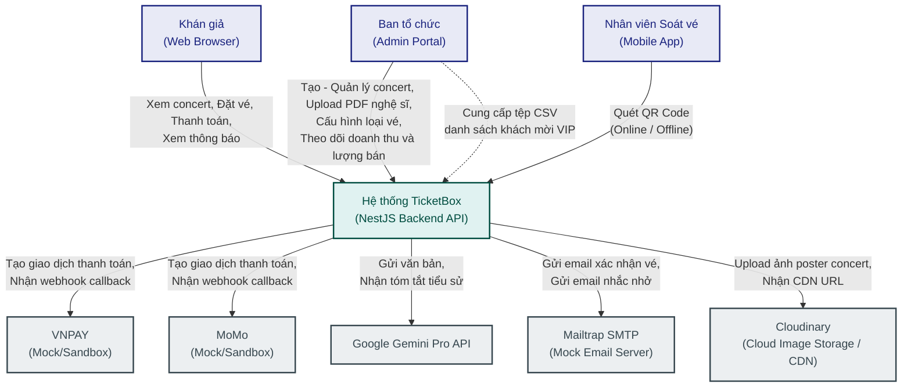

### Level 2 — Container Diagram

```mermaid
flowchart TD
    classDef actor fill:#e8eaf6,stroke:#1a237e,stroke-width:2px,color:#1a237e;
    classDef client fill:#f3e5f5,stroke:#4a148c,stroke-width:2px,color:#4a148c;
    classDef gateway fill:#eceff1,stroke:#37474f,stroke-width:2px,color:#37474f;
    classDef app fill:#e0f2f1,stroke:#004d40,stroke-width:2px,color:#004d40;
    classDef db fill:#fff8e1,stroke:#ff6f00,stroke-width:2px,color:#824a00;
    classDef mq fill:#fbe9e7,stroke:#bf360c,stroke-width:2px,color:#bf360c;
    classDef external fill:#fce4ec,stroke:#880e4f,stroke-width:2px,color:#880e4f;

    %% Actors (Tác nhân hệ thống)
    KhanGia["Khán giả<br/>(Person)"]:::actor
    BanToChuc["Ban tổ chức<br/>(Person)"]:::actor
    NhanVienSoatVe["Nhân viên soát vé<br/>(Person)"]:::actor

    subgraph TicketBoxSystem["Hệ thống TicketBox (System Boundary)"]
        %% Clients
        WebApp["Web Application<br/>(React)"]:::client
        MobileApp["Mobile Check-in App<br/>(Flutter)"]:::client

        %% Gateway
        Nginx["Nginx<br/>(Reverse Proxy / Load Balancer)"]:::gateway

        %% API App
        NestJS["NestJS API Application<br/>(Modular Monolith)"]:::app

        %% Databases - Broker
        Postgres[("PostgreSQL Database<br/>(Primary Storage — UUID v7)")]:::db
        Redis[("Redis Cache / Store<br/>(Cache + Atomic Ops + Rate Limit)")]:::db
        RabbitMQ{{"RabbitMQ Message Broker<br/>(Booking Queue + Notif Exchange)"}}:::mq
    end

    %% External Systems (Hệ thống bên ngoài)
    VNPAY["VNPAY<br/>(Payment Gateway)"]:::external
    MoMo["MoMo<br/>(Payment Gateway)"]:::external
    GeminiAPI["Google Gemini API<br/>(AI Service)"]:::external
    SMTP["Mailtrap SMTP<br/>(Mock Email Server)"]:::external
    Cloudinary["Cloudinary<br/>(Cloud Image Storage / CDN)"]:::external

    %% Kết nối từ Tác nhân tới Client
    KhanGia -->|"Xem concert, Đặt vé, Thanh toán"| WebApp
    BanToChuc -->|"Quản lý concert, Xem thống kê"| WebApp
    NhanVienSoatVe -->|"Quét mã QR để soát vé"| MobileApp

    %% Kết nối từ Client tới Gateway/Backend
    WebApp -->|"Gửi API requests (HTTPS)"| Nginx
    MobileApp -->|"Gửi API requests - Đồng bộ (HTTPS)"| Nginx
    Nginx -->|"Chuyển tiếp requests"| NestJS

    %% Kết nối từ Backend tới các Container dữ liệu
    NestJS -->|"Đọc/Ghi dữ liệu (TypeORM)"| Postgres
    NestJS -->|"Đọc/Ghi Cache, Lua Script, Rate Limit"| Redis
    NestJS -->|"Publish / Subscribe message tasks"| RabbitMQ

    %% Kết nối tới các Hệ thống bên ngoài
    NestJS -->|"Tạo giao dịch - Nhận webhook"| VNPAY
    NestJS -->|"Tạo giao dịch - Nhận webhook"| MoMo
    NestJS -->|"Gửi thông tin nghệ sĩ để tóm tắt"| GeminiAPI
    NestJS -->|"Gửi email xác nhận / nhắc nhở"| SMTP
    NestJS -->|"Upload ảnh poster, Nhận CDN URL"| Cloudinary
    SMTP -.->|"Gửi email thông báo tới"| KhanGia
```

---

## High-Level Architecture Diagram

Sơ đồ dưới đây mô tả luồng dữ liệu chính của hệ thống, đặc biệt tại các điểm tích hợp và luồng soát vé offline:

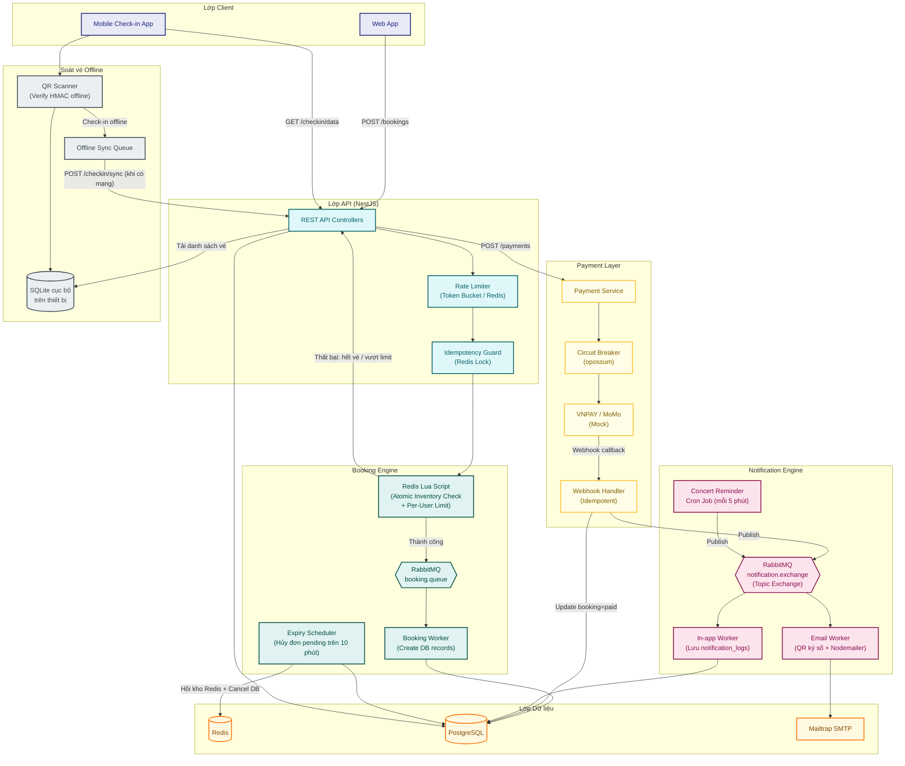

---

## Thiết kế cơ sở dữ liệu

### Lựa chọn Database Engine

#### Các phương án cân nhắc

| #   | Phương án      | Mô tả                                                                                                                                     |
| --- | -------------- | ----------------------------------------------------------------------------------------------------------------------------------------- |
| A   | **PostgreSQL** | RDBMS mã nguồn mở mạnh nhất, hỗ trợ ACID transaction đầy đủ, kiểu dữ liệu phong phú (UUID native, JSONB, Array), extension ecosystem lớn. |
| B   | **MongoDB**    | NoSQL document store, schema linh hoạt, horizontal scaling tốt qua sharding.                                                              |
| C   | **MySQL**      | RDBMS phổ biến, đơn giản, hiệu năng đọc tốt, community lớn.                                                                               |

#### Đánh giá

| Tiêu chí                                                     | PostgreSQL                        | MongoDB                                              | MySQL                           |
| ------------------------------------------------------------ | --------------------------------- | ---------------------------------------------------- | ------------------------------- |
| ACID Transaction                                             | ✅ Đầy đủ                         | ⚠️ Có nhưng hạn chế (multi-doc transaction chậm hơn) | ✅ Đầy đủ (InnoDB)              |
| Hỗ trợ UUID native                                           | ✅ Kiểu `uuid`, gen_random_uuid() | ⚠️ Lưu dạng string/binary                            | ❌ Không có kiểu native         |
| Quan hệ phức tạp (FK, JOIN)                                  | ✅ Mạnh                           | ❌ Không có FK, JOIN kém                             | ✅ Tốt                          |
| JSONB cho dữ liệu linh hoạt                                  | ✅ Có, indexed                    | ✅ Native document                                   | ❌ JSON có nhưng index yếu      |
| Tích hợp NestJS (TypeORM/Prisma)                             | ✅ First-class support            | ✅ Mongoose / Prisma                                 | ✅ TypeORM                      |
| Phù hợp bài toán booking (quan hệ chặt chẽ, consistency cao) | ✅ Rất phù hợp                    | ❌ Không phù hợp (eventual consistency)              | ⚠️ Phù hợp nhưng kém PostgreSQL |

#### Chốt giải pháp: PostgreSQL

**Lý do:** Hệ thống bán vé yêu cầu **strong consistency** (không over-selling) và có **quan hệ phức tạp** giữa users → bookings → tickets → checkin_logs. PostgreSQL cung cấp ACID transaction đầy đủ, hỗ trợ UUID native, và tích hợp tốt với NestJS qua TypeORM/Prisma. MongoDB không phù hợp vì bài toán này đòi hỏi referential integrity chặt chẽ.

---

### Lựa chọn Primary Key Strategy

#### Các phương án cân nhắc

| #   | Phương án     | Mô tả                                                                                                     |
| --- | ------------- | --------------------------------------------------------------------------------------------------------- |
| A   | **UUID v4**   | Random UUID, 128-bit, globally unique. Không chứa thông tin thời gian.                                    |
| B   | **UUID v7**   | Time-ordered UUID (RFC 9562), 128-bit. Các bit đầu tiên chứa Unix timestamp (ms), phần còn lại là random. |
| C   | **BIGSERIAL** | Auto-increment integer (8 bytes). Tuần tự, nhỏ gọn, nhưng lộ thông tin về số lượng bản ghi.               |

#### Đánh giá

| Tiêu chí                               | UUID v4                                      | UUID v7                                            | BIGSERIAL               |
| -------------------------------------- | -------------------------------------------- | -------------------------------------------------- | ----------------------- |
| Globally unique (không cần DB để sinh) | ✅                                           | ✅                                                 | ❌ Cần DB sequence      |
| B-Tree index performance               | ❌ Random → page fragmentation cao, ghi chậm | ✅ Time-ordered → sequential insert, ít page split | ✅ Tuần tự, tối ưu nhất |
| Kích thước                             | 16 bytes                                     | 16 bytes                                           | 8 bytes                 |
| Sắp xếp theo thời gian tạo             | ❌ Không                                     | ✅ Có (timestamp embedded)                         | ✅ Có (auto-increment)  |
| Bảo mật (không lộ số lượng)            | ✅                                           | ✅                                                 | ❌ Lộ tổng số bản ghi   |
| Dùng làm ID trong distributed system   | ✅                                           | ✅                                                 | ❌ Conflict khi merge   |

#### Chốt giải pháp: UUID v7 cho bảng nghiệp vụ, BIGSERIAL cho bảng log

**Lý do:**

- **UUID v7** kết hợp ưu điểm của cả UUID v4 (globally unique, không lộ info) và BIGSERIAL (time-ordered, B-Tree friendly). So với UUID v4, UUID v7 giảm đáng kể random I/O và page split khi ghi vào PostgreSQL — hiệu năng ghi có thể tăng 2-3x trong workload insert-heavy.
- **BIGSERIAL** chỉ dùng cho bảng `notification_logs` — bảng log có volume ghi rất cao nhưng không cần globally unique ID. BIGSERIAL tiết kiệm 8 bytes/row và ghi nhanh nhất.

---

### Entity-Relationship Diagram (ERD)

```mermaid
erDiagram
    USERS {
        uuid_v7 id PK
        varchar email UK
        varchar password_hash
        varchar full_name
        varchar role
        varchar status
        timestamp created_at
    }
    CONCERTS {
        uuid_v7 id PK
        varchar title
        text description
        varchar location
        varchar poster_url
        text summary
        varchar_arr tags
        text svg_stage_map
        timestamp start_time
        timestamp end_time
        varchar status
        boolean reminder_sent
        timestamp created_at
    }
    TICKET_TYPES {
        uuid_v7 id PK
        uuid_v7 concert_id FK
        varchar name
        decimal price
        integer total_quantity
        integer available_quantity
        integer max_per_user
        timestamp sale_start_time
        timestamp sale_end_time
    }
    BOOKINGS {
        uuid_v7 id PK
        uuid_v7 user_id FK
        uuid_v7 concert_id FK
        varchar status
        decimal total_amount
        varchar idempotency_key UK
        timestamp expires_at
        timestamp created_at
    }
    PAYMENTS {
        uuid_v7 id PK
        uuid_v7 booking_id FK
        varchar method
        varchar gateway_txn_id UK
        decimal amount
        varchar status
        jsonb gateway_response
        timestamp paid_at
        timestamp created_at
    }
    TICKETS {
        uuid_v7 id PK
        uuid_v7 booking_id FK
        uuid_v7 ticket_type_id FK
        varchar qr_code_hash
        varchar checkin_status
        timestamp checked_in_at
    }
    CHECKIN_LOGS {
        uuid_v7 id PK
        uuid_v7 ticket_id FK
        uuid_v7 vip_guest_id FK
        uuid_v7 checked_by FK
        timestamp scan_time
        boolean is_offline
        varchar device_id
    }
    VIP_GUESTS {
        uuid_v7 id PK
        uuid_v7 concert_id FK
        varchar full_name
        varchar email
        varchar phone
        varchar affiliate_company
        varchar qr_code_hash
        varchar checkin_status
        timestamp checked_in_at
    }
    NOTIFICATION_LOGS {
        bigserial id PK
        uuid_v7 user_id FK
        varchar type
        varchar title
        text body
        varchar channel
        varchar status
        uuid_v7 reference_id
        timestamp read_at
        timestamp sent_at
        timestamp created_at
    }

    CONCERTS ||--o{ TICKET_TYPES : "has many"
    USERS ||--o{ BOOKINGS : "places"
    BOOKINGS ||--o{ PAYMENTS : "has many"
    BOOKINGS ||--o{ TICKETS : "contains"
    TICKET_TYPES ||--o{ TICKETS : "instantiates"
    TICKETS ||--o{ CHECKIN_LOGS : "logs"
    VIP_GUESTS ||--o{ CHECKIN_LOGS : "logs"
    CONCERTS ||--o{ VIP_GUESTS : "has many"
    USERS ||--o{ NOTIFICATION_LOGS : "receives"
```

### Đặc tả chi tiết các bảng cơ sở dữ liệu

Dưới đây là đặc tả chi tiết của từng bảng trong cơ sở dữ liệu bao gồm các cột, kiểu dữ liệu, ràng buộc (constraints), mô tả chi tiết, cùng với các quy tắc nghiệp vụ (Business Rules) và các chỉ mục (Indexes) đi kèm.

---

#### 1. Bảng `USERS` (Thông tin người dùng)

##### Đặc tả chi tiết (Table Specification)

| Column | Type | Constraints | Description |
| :--- | :--- | :--- | :--- |
| **id** | `uuid` | `PRIMARY KEY` | Khóa chính, ID duy nhất của người dùng dạng UUID v7 |
| **email** | `varchar(255)` | `UNIQUE`, `NOT NULL` | Địa chỉ email người dùng, dùng làm thông tin đăng nhập chính |
| **password_hash** | `varchar(255)` | `NOT NULL` | Mật khẩu người dùng đã được băm (hash) bằng bcrypt |
| **full_name** | `varchar(255)` | `NOT NULL` | Họ và tên của người dùng |
| **role** | `varchar(50)` | `NOT NULL`, `DEFAULT 'audience'`, `CHECK (role IN ('audience', 'organizer', 'gate_staff'))` | Vai trò của người dùng trong hệ thống (Khán giả, Ban tổ chức, Nhân viên soát vé) |
| **status** | `varchar(50)` | `NOT NULL`, `DEFAULT 'pending'`, `CHECK (status IN ('pending', 'active'))` | Trạng thái hoạt động của tài khoản (Chờ kích hoạt, Đang hoạt động) |
| **created_at** | `timestamp` | `NOT NULL`, `DEFAULT CURRENT_TIMESTAMP` | Thời điểm tạo tài khoản người dùng |

##### Business Rules
- Địa chỉ `email` phải duy nhất trên toàn hệ thống và tuân thủ định dạng email chuẩn.
- `role` bắt buộc phải là một trong các giá trị định sẵn: `audience` (mặc định khi đăng ký), `organizer` (tài khoản quản lý của ban tổ chức), `gate_staff` (nhân viên dùng mobile app quét vé).
- `status` bắt buộc phải là `pending` (mặc định ban đầu chờ kích hoạt) hoặc `active` (đã xác thực mã OTP thành công).
- Một email chỉ được đăng ký tối đa một tài khoản (Unique constraint).
- Tài khoản ở trạng thái `pending` sẽ bị chặn đăng nhập và yêu cầu xác thực OTP qua email để chuyển thành `active` trước khi sử dụng các dịch vụ.

##### Indexes
| Index Name | Columns | Type | Purpose |
| :--- | :--- | :--- | :--- |
| `pk_users` | `id` | `PRIMARY KEY (B-Tree)` | Tự động tạo cho khóa chính |
| `uq_users_email` | `email` | `UNIQUE (B-Tree)` | Đảm bảo email duy nhất và tối ưu hóa truy vấn đăng nhập |

---

#### 2. Bảng `CONCERTS` (Thông tin buổi biểu diễn)

##### Đặc tả chi tiết (Table Specification)

| Column | Type | Constraints | Description |
| :--- | :--- | :--- | :--- |
| **id** | `uuid` | `PRIMARY KEY` | Khóa chính dạng UUID v7 |
| **title** | `varchar(255)` | `NOT NULL` | Tên của concert |
| **description** | `text` | `NOT NULL` | Mô tả chi tiết nội dung buổi biểu diễn |
| **location** | `varchar(255)` | `NOT NULL` | Địa điểm tổ chức concert |
| **poster_url** | `varchar(500)` | `NULL` | Đường dẫn CDN ảnh poster của concert lưu trữ trên Cloudinary |
| **summary** | `text` | `NULL` | Tóm tắt tiểu sử nghệ sĩ hoặc giới thiệu concert (sinh bằng AI) |
| **tags** | `varchar(50)[]` | `NOT NULL`, `DEFAULT '{}'` | Danh sách tag (mảng chuỗi) hỗ trợ phân loại và tìm kiếm |
| **svg_stage_map** | `text` | `NULL` | Bản đồ sơ đồ ghế ngồi/sân khấu dạng chuỗi SVG để hiển thị trên client và cache ở Redis |
| **start_time** | `timestamp` | `NOT NULL` | Thời gian bắt đầu buổi diễn |
| **end_time** | `timestamp` | `NOT NULL` | Thời gian kết thúc dự kiến |
| **status** | `varchar(50)` | `NOT NULL`, `DEFAULT 'draft'`, `CHECK (status IN ('draft', 'active', 'cancelled'))` | Trạng thái buổi diễn: nháp (`draft`), đang mở bán (`active`), bị hủy (`cancelled`) |
| **reminder_sent** | `boolean` | `NOT NULL`, `DEFAULT FALSE` | Đánh dấu đã gửi email nhắc nhở trước sự kiện hay chưa |
| **created_at** | `timestamp` | `NOT NULL`, `DEFAULT CURRENT_TIMESTAMP` | Thời điểm tạo bản ghi concert |

##### Business Rules
- Thời gian kết thúc `end_time` bắt buộc phải lớn hơn thời gian bắt đầu `start_time`.
- Trạng thái `status` mặc định là `draft` khi khởi tạo. Chỉ những concert có trạng thái `active` mới được phép xuất hiện trên trang chủ cho người dùng tìm kiếm và đặt vé.
- `tags` là mảng các chuỗi không được chứa ký tự đặc biệt nguy hiểm và dùng để filter nhanh.

##### Indexes
| Index Name | Columns | Type | Purpose |
| :--- | :--- | :--- | :--- |
| `pk_concerts` | `id` | `PRIMARY KEY (B-Tree)` | Tự động tạo cho khóa chính |
| `idx_concerts_status_start_time` | `status, start_time` | `B-Tree` | Tìm kiếm nhanh các concert đang active và sắp diễn ra, phục vụ cron job gửi nhắc nhở |
| `idx_concerts_tags` | `tags` | `GIN` | Tối ưu hóa truy vấn tìm kiếm concert theo các phần tử trong mảng tag |

---

#### 3. Bảng `TICKET_TYPES` (Cấu hình loại vé)

##### Đặc tả chi tiết (Table Specification)

| Column | Type | Constraints | Description |
| :--- | :--- | :--- | :--- |
| **id** | `uuid` | `PRIMARY KEY` | Khóa chính dạng UUID v7 |
| **concert_id** | `uuid` | `FOREIGN KEY REFERENCES CONCERTS(id) ON DELETE CASCADE` | Khóa ngoại trỏ đến concert tương ứng |
| **name** | `varchar(100)` | `NOT NULL`, `CHECK (name IN ('GA', 'SVIP', 'VIP', 'CAT1', 'CAT2'))` | Tên loại vé (chỉ được là một trong các giá trị: GA, SVIP, VIP, CAT1, CAT2) |
| **price** | `decimal(12, 2)` | `NOT NULL`, `CHECK (price >= 0)` | Giá vé |
| **total_quantity** | `integer` | `NOT NULL`, `CHECK (total_quantity > 0)` | Tổng số lượng vé phát hành cho loại này |
| **available_quantity** | `integer` | `NOT NULL`, `CHECK (available_quantity >= 0 AND available_quantity <= total_quantity)` | Số lượng vé còn lại trong kho có thể bán |
| **max_per_user** | `integer` | `NOT NULL`, `DEFAULT 4`, `CHECK (max_per_user > 0)` | Giới hạn số lượng vé tối đa của loại này một người dùng được đặt mua |
| **sale_start_time** | `timestamp` | `NULL` | Thời điểm bắt đầu bán vé. Nếu để trống, vé được mở bán ngay khi concert được kích hoạt (active) |
| **sale_end_time** | `timestamp` | `NULL` | Thời điểm kết thúc bán vé. Phải lớn hơn `sale_start_time`. Nếu để trống, mặc định bán cho đến khi concert kết thúc |

##### Business Rules
- Tên loại vé `name` phải là duy nhất trong phạm vi một buổi biểu diễn cụ thể (ví dụ: một concert không thể có hai loại vé cùng tên "VIP").
- Tên loại vé bắt buộc phải nằm trong danh sách giới hạn các nhóm phân hạng: `GA`, `SVIP`, `VIP`, `CAT1`, `CAT2`. Quy tắc này được áp dụng cả ở mức database check constraint (`chk_ticket_types_name`) và ở lớp validation DTO (`@IsEnum(TicketTypeName)`).
- `available_quantity` ban đầu phải bằng `total_quantity` và giảm dần khi có người đặt vé. Không bao giờ được phép nhỏ hơn 0.
- Số vé tối đa một người được đặt (`max_per_user`) dùng để ngăn chặn đầu cơ vé.
- Có ràng buộc kiểm tra ở mức database (`CHECK (sale_end_time IS NULL OR sale_start_time IS NULL OR sale_end_time > sale_start_time)`) để đảm bảo tính hợp lệ của thời gian bán vé.
- Tại thời điểm khách hàng đặt mua vé, hệ thống kiểm tra thời gian hiện tại (`now`):
  - `now` phải lớn hơn hoặc bằng `sale_start_time` (nếu đã cấu hình).
  - `now` phải nhỏ hơn hoặc bằng `sale_end_time` (nếu đã cấu hình).
  - `sale_start_time` bắt buộc phải diễn ra trước khi concert kết thúc (`sale_start_time < concert.end_time`).

##### Indexes
| Index Name | Columns | Type | Purpose |
| :--- | :--- | :--- | :--- |
| `pk_ticket_types` | `id` | `PRIMARY KEY (B-Tree)` | Tự động tạo cho khóa chính |
| `idx_ticket_types_concert_id` | `concert_id` | `B-Tree` | Lấy nhanh toàn bộ loại vé của một concert |
| `uq_concert_ticket_type_name` | `concert_id, name` | `UNIQUE (B-Tree)` | Đảm bảo tính duy nhất của tên loại vé trong cùng một concert |

---

#### 4. Bảng `BOOKINGS` (Đơn đặt vé)

##### Đặc tả chi tiết (Table Specification)

| Column | Type | Constraints | Description |
| :--- | :--- | :--- | :--- |
| **id** | `uuid` | `PRIMARY KEY` | Khóa chính dạng UUID v7 |
| **user_id** | `uuid` | `FOREIGN KEY REFERENCES USERS(id) ON DELETE RESTRICT` | Khóa ngoại trỏ đến người mua vé |
| **concert_id** | `uuid` | `FOREIGN KEY REFERENCES CONCERTS(id) ON DELETE RESTRICT` | Khóa ngoại trỏ đến concert được đặt vé |
| **status** | `varchar(50)` | `NOT NULL`, `DEFAULT 'pending'`, `CHECK (status IN ('pending', 'paid', 'expired', 'cancelled'))` | Trạng thái của đơn hàng: chờ thanh toán (`pending`), đã thanh toán (`paid`), quá hạn hủy tự động (`expired`), bị hủy bởi người dùng (`cancelled`) |
| **total_amount** | `decimal(12, 2)` | `NOT NULL`, `CHECK (total_amount >= 0)` | Tổng số tiền của đơn hàng |
| **idempotency_key** | `varchar(255)` | `UNIQUE`, `NOT NULL` | Chuỗi mã định danh do client gửi lên nhằm chống trùng lặp đơn hàng |
| **expires_at** | `timestamp` | `NOT NULL` | Thời hạn thanh toán của đơn hàng (10 phút kể từ lúc tạo) |
| **created_at** | `timestamp` | `NOT NULL`, `DEFAULT CURRENT_TIMESTAMP` | Thời điểm tạo đơn đặt vé |

##### Business Rules
- Khi khởi tạo, đơn hàng bắt buộc ở trạng thái `pending`.
- `expires_at` mặc định được gán bằng `created_at + 10 minutes`. Khi xảy ra sự cố sập toàn bộ cổng thanh toán trực tuyến (cả hai Circuit Breaker đều `OPEN`), hệ thống sẽ chặn không cho phép tạo đơn hàng mới (`POST /bookings` trả về lỗi bảo trì luồng mua vé). Các đơn đặt hàng đang ở trạng thái `pending` trước đó vẫn giữ nguyên thời hạn thanh toán là 10 phút và không được gia hạn thêm nhằm tránh tình trạng giữ vé ma.
- Nếu hết thời gian `expires_at` mà đơn hàng chưa sang `paid`, cron job quét sẽ chuyển trạng thái sang `expired` và thực hiện hoàn trả số vé đã giữ về lại kho Redis (compensation).
- Ràng buộc khóa ngoại không cho phép xóa Concert (`ON DELETE RESTRICT`) hoặc User (`ON DELETE RESTRICT`) khi đã phát sinh đơn hàng.

##### Indexes
| Index Name | Columns | Type | Purpose |
| :--- | :--- | :--- | :--- |
| `pk_bookings` | `id` | `PRIMARY KEY (B-Tree)` | Tự động tạo cho khóa chính |
| `idx_bookings_user_id` | `user_id` | `B-Tree` | Truy vấn nhanh lịch sử mua vé của người dùng |
| `idx_bookings_status_expires_at` | `status, expires_at` | `B-Tree` | Hỗ trợ cron job quét định kỳ các đơn hàng pending đã hết hạn để xử lý hủy vé |
| `uq_bookings_idempotency_key` | `idempotency_key` | `UNIQUE (B-Tree)` | Lớp bảo vệ chống trùng lặp giao dịch đặt vé ở mức Database |

---

#### 5. Bảng `PAYMENTS` (Giao dịch thanh toán)

##### Đặc tả chi tiết (Table Specification)

| Column | Type | Constraints | Description |
| :--- | :--- | :--- | :--- |
| **id** | `uuid` | `PRIMARY KEY` | Khóa chính dạng UUID v7 |
| **booking_id** | `uuid` | `FOREIGN KEY REFERENCES BOOKINGS(id) ON DELETE RESTRICT` | Khóa ngoại liên kết tới đơn đặt vé tương ứng |
| **method** | `varchar(50)` | `NOT NULL`, `CHECK (method IN ('vnpay', 'momo'))` | Cổng thanh toán sử dụng (VNPAY hoặc MoMo) |
| **gateway_txn_id** | `varchar(255)` | `UNIQUE`, `NOT NULL` | Mã giao dịch duy nhất do cổng thanh toán trả về |
| **amount** | `decimal(12, 2)` | `NOT NULL`, `CHECK (amount >= 0)` | Số tiền thực tế giao dịch thanh toán |
| **status** | `varchar(50)` | `NOT NULL`, `DEFAULT 'pending'`, `CHECK (status IN ('pending', 'success', 'failed', 'refunded'))` | Trạng thái giao dịch thanh toán |
| **gateway_response** | `jsonb` | `NULL` | Dữ liệu phản hồi nguyên bản (raw response) từ cổng thanh toán lưu dưới dạng JSON |
| **paid_at** | `timestamp` | `NULL` | Thời điểm thanh toán thành công (nếu giao dịch thành công) |
| **created_at** | `timestamp` | `NOT NULL`, `DEFAULT CURRENT_TIMESTAMP` | Thời điểm tạo bản ghi thanh toán |

##### Business Rules
- Một đơn hàng (`booking_id`) có thể có nhiều bản ghi thanh toán nếu các lần thanh toán trước bị thất bại (`failed`), nhưng tối đa chỉ được có duy nhất một giao dịch ở trạng thái thành công (`success`).
- `gateway_txn_id` hoạt động như một khóa chống trùng lặp (Idempotency Key) cho các cuộc gọi webhook từ phía cổng thanh toán. Webhook chỉ xử lý cập nhật trạng thái đơn đặt vé thành `paid` nếu giao dịch thanh toán chưa từng được ghi nhận thành công trước đó.

##### Indexes
| Index Name | Columns | Type | Purpose |
| :--- | :--- | :--- | :--- |
| `pk_payments` | `id` | `PRIMARY KEY (B-Tree)` | Tự động tạo cho khóa chính |
| `idx_payments_booking_id` | `booking_id` | `B-Tree` | Truy cập lịch sử các lần thanh toán của một đơn hàng |
| `uq_payments_gateway_txn_id` | `gateway_txn_id` | `UNIQUE (B-Tree)` | Đảm bảo tính duy nhất của mã giao dịch cổng thanh toán và xử lý webhook idempotent |

---

#### 6. Bảng `TICKETS` (Thông tin vé đã xuất)

##### Đặc tả chi tiết (Table Specification)

| Column | Type | Constraints | Description |
| :--- | :--- | :--- | :--- |
| **id** | `uuid` | `PRIMARY KEY` | Khóa chính dạng UUID v7 |
| **booking_id** | `uuid` | `FOREIGN KEY REFERENCES BOOKINGS(id) ON DELETE RESTRICT` | Khóa ngoại liên kết tới đơn hàng chứa vé này |
| **ticket_type_id** | `uuid` | `FOREIGN KEY REFERENCES TICKET_TYPES(id) ON DELETE RESTRICT` | Khóa ngoại liên kết tới cấu hình loại vé |
| **qr_code_hash** | `varchar(255)` | `UNIQUE`, `NOT NULL` | Chuỗi băm SHA-256 chứa thông tin vé đã ký số (HMAC) dùng in QR Code |
| **checkin_status** | `varchar(50)` | `NOT NULL`, `DEFAULT 'not_checked_in'`, `CHECK (checkin_status IN ('not_checked_in', 'checked_in'))` | Trạng thái soát vé vào cửa (Chưa soát vé, Đã soát vé) |
| **checked_in_at** | `timestamp` | `NULL` | Thời điểm soát vé thành công |

##### Business Rules
- Vé chỉ được tự động tạo bởi Booking Worker sau khi đơn đặt vé `BOOKINGS` tương ứng được cập nhật trạng thái `paid`.
- `qr_code_hash` là duy nhất trên toàn hệ thống. Đây là chuỗi băm của thông tin vé kèm theo chữ ký HMAC của server để ngăn chặn việc làm giả vé và không lộ thông tin nhạy cảm.
- Một vé chỉ được check-in tối đa 1 lần. Khi quét thành công, `checkin_status` chuyển sang `checked_in` và ghi lại `checked_in_at`. Mọi lượt quét sau đó trên mã QR này đều sẽ bị báo lỗi trùng lặp.

##### Indexes
| Index Name | Columns | Type | Purpose |
| :--- | :--- | :--- | :--- |
| `pk_tickets` | `id` | `PRIMARY KEY (B-Tree)` | Tự động tạo cho khóa chính |
| `idx_tickets_booking_id` | `booking_id` | `B-Tree` | Lấy danh sách tất cả các vé thuộc một đơn đặt vé cụ thể |
| `uq_tickets_qr_code_hash` | `qr_code_hash` | `UNIQUE (B-Tree)` | Phục vụ đối soát nhanh thông tin khi nhân viên soát vé quét mã QR tại cổng vào |

---

#### 7. Bảng `CHECKIN_LOGS` (Nhật ký soát vé)

##### Đặc tả chi tiết (Table Specification)

| Column | Type | Constraints | Description |
| :--- | :--- | :--- | :--- |
| **id** | `uuid` | `PRIMARY KEY` | Khóa chính dạng UUID v7 |
| **ticket_id** | `uuid` | `NULL`, `FOREIGN KEY REFERENCES TICKETS(id) ON DELETE SET NULL` | Khóa ngoại liên kết tới vé thông thường được quét |
| **vip_guest_id** | `uuid` | `NULL`, `FOREIGN KEY REFERENCES VIP_GUESTS(id) ON DELETE SET NULL` | Khóa ngoại liên kết tới khách VIP được quét |
| **checked_by** | `uuid` | `FOREIGN KEY REFERENCES USERS(id) ON DELETE RESTRICT` | Khóa ngoại liên kết đến tài khoản nhân viên thực hiện quét mã |
| **scan_time** | `timestamp` | `NOT NULL`, `DEFAULT CURRENT_TIMESTAMP` | Thời điểm thực hiện quét mã |
| **is_offline** | `boolean` | `NOT NULL`, `DEFAULT FALSE` | Đánh dấu lượt quét này được ghi nhận offline tại app và đồng bộ lên sau |
| **device_id** | `varchar(255)` | `NOT NULL` | Định danh thiết bị phần cứng (điện thoại quét) dùng soát vé |

##### Business Rules
- Để hỗ trợ audit đồng nhất cho cả khách VIP và vé thông thường, bảng này thiết kế hai khóa ngoại nullable: `ticket_id` và `vip_guest_id`. Bắt buộc phải có đúng một trong hai trường này có giá trị (CHECK constraint: `CHECK ((ticket_id IS NOT NULL AND vip_guest_id IS NULL) OR (ticket_id IS NULL AND vip_guest_id IS NOT NULL))`).
- Bản ghi log check-in là dữ liệu lịch sử mang tính chất audit trail, sau khi insert thành công không được phép cập nhật (`UPDATE`) hoặc xóa (`DELETE`).
- Tài khoản thực hiện soát vé `checked_by` phải có vai trò `gate_staff` hoặc `organizer`.

##### Indexes
| Index Name | Columns | Type | Purpose |
| :--- | :--- | :--- | :--- |
| `pk_checkin_logs` | `id` | `PRIMARY KEY (B-Tree)` | Tự động tạo cho khóa chính |
| `idx_checkin_logs_ticket_id` | `ticket_id` | `B-Tree` | Phục vụ tra cứu lịch sử quét của một vé (hỗ trợ điều tra khi có sự cố quét trùng mã) |
| `idx_checkin_logs_vip_guest_id` | `vip_guest_id` | `B-Tree` | Tra cứu lịch sử check-in của khách mời VIP |
| `idx_checkin_logs_scan_time` | `scan_time` | `B-Tree` | Thống kê số lượng vé được soát theo thời gian thực tại sự kiện |

---

#### 8. Bảng `VIP_GUESTS` (Khách mời VIP)

##### Đặc tả chi tiết (Table Specification)

| Column | Type | Constraints | Description |
| :--- | :--- | :--- | :--- |
| **id** | `uuid` | `PRIMARY KEY` | Khóa chính dạng UUID v7 |
| **concert_id** | `uuid` | `FOREIGN KEY REFERENCES CONCERTS(id) ON DELETE CASCADE` | Khóa ngoại trỏ đến concert khách VIP được mời tham dự |
| **full_name** | `varchar(255)` | `NOT NULL` | Họ và tên khách mời VIP |
| **email** | `varchar(255)` | `NOT NULL` | Địa chỉ email nhận thư mời và mã QR check-in |
| **phone** | `varchar(20)` | `NULL` | Số điện thoại khách mời VIP |
| **affiliate_company** | `varchar(255)` | `NULL` | Tên tổ chức/doanh nghiệp hoặc đơn vị công tác của khách mời |
| **qr_code_hash** | `varchar(255)` | `UNIQUE`, `NOT NULL` | Chuỗi băm mã QR gửi riêng cho khách mời để check-in |
| **checkin_status** | `varchar(50)` | `NOT NULL`, `DEFAULT 'not_checked_in'`, `CHECK (checkin_status IN ('not_checked_in', 'checked_in'))` | Trạng thái check-in của khách VIP |
| **checked_in_at** | `timestamp` | `NULL` | Thời điểm khách VIP check-in thành công |

##### Business Rules
- Khách VIP được Ban tổ chức (`organizer`) quản lý bằng cách import tệp CSV danh sách khách mời.
- `qr_code_hash` của khách VIP là duy nhất trên toàn hệ thống và hoạt động độc lập với bảng vé thông thường.
- Tương tự như vé, mỗi khách VIP chỉ được phép check-in một lần duy nhất.

##### Indexes
| Index Name | Columns | Type | Purpose |
| :--- | :--- | :--- | :--- |
| `pk_vip_guests` | `id` | `PRIMARY KEY (B-Tree)` | Tự động tạo cho khóa chính |
| `idx_vip_guests_concert_id` | `concert_id` | `B-Tree` | Lấy toàn bộ danh sách khách VIP của một concert phục vụ đồng bộ dữ liệu check-in |
| `uq_vip_guests_qr_code_hash` | `qr_code_hash` | `UNIQUE (B-Tree)` | Quét check-in nhanh đối với khách VIP bằng mã QR |

---

#### 9. Bảng `NOTIFICATION_LOGS` (Nhật ký thông báo)

##### Đặc tả chi tiết (Table Specification)

| Column | Type | Constraints | Description |
| :--- | :--- | :--- | :--- |
| **id** | `bigint` | `PRIMARY KEY` | Khóa chính tự tăng dạng `bigserial` để tối ưu dung lượng lưu trữ cho dữ liệu log lớn |
| **user_id** | `uuid` | `FOREIGN KEY REFERENCES USERS(id) ON DELETE CASCADE` | Khóa ngoại trỏ đến người nhận thông báo |
| **type** | `varchar(50)` | `NOT NULL`, `CHECK (type IN ('booking_confirmed', 'concert_reminder'))` | Loại thông báo: xác nhận đặt vé (`booking_confirmed`), nhắc nhở concert sắp diễn ra (`concert_reminder`) |
| **title** | `varchar(255)` | `NOT NULL` | Tiêu đề thông báo |
| **body** | `text` | `NOT NULL` | Nội dung chi tiết của thông báo |
| **channel** | `varchar(50)` | `NOT NULL`, `CHECK (channel IN ('in_app', 'email'))` | Kênh gửi thông báo (thông báo trong ứng dụng hoặc email) |
| **status** | `varchar(50)` | `NOT NULL`, `DEFAULT 'pending'`, `CHECK (status IN ('pending', 'sent', 'failed'))` | Trạng thái gửi thông báo |
| **reference_id** | `uuid` | `NULL` | Khóa ngoại tham chiếu động (nullable) đến ID của đơn hàng hoặc concert liên quan |
| **read_at** | `timestamp` | `NULL` | Thời điểm người dùng đọc thông báo (chỉ có ý nghĩa khi `channel` là `in_app`) |
| **sent_at** | `timestamp` | `NULL` | Thời điểm thực tế gửi thông báo thành công |
| **created_at** | `timestamp` | `NOT NULL`, `DEFAULT CURRENT_TIMESTAMP` | Thời điểm tạo bản ghi log thông báo |

##### Business Rules
- `read_at` chỉ được phép cập nhật khi thông báo được gửi qua kênh `in_app`. Đối với kênh `email`, trường này luôn là `NULL`.
- Bảng này sử dụng kiểu khóa chính tự tăng `bigserial` thay vì UUID v7 nhằm tiết kiệm 8 bytes cho mỗi hàng ghi, do bảng này lưu lịch sử log với volume cực lớn.

##### Indexes
| Index Name | Columns | Type | Purpose |
| :--- | :--- | :--- | :--- |
| `pk_notification_logs` | `id` | `PRIMARY KEY (B-Tree)` | Tự động tạo cho khóa chính |
| `idx_notification_logs_user_id_read_at` | `user_id, read_at` | `B-Tree` | Truy vấn và đếm nhanh số lượng thông báo in-app chưa đọc (`read_at IS NULL`) của một người dùng cụ thể |

---


## Thiết kế kiểm soát truy cập

### Mô hình phân quyền: Role-Based Access Control (RBAC)

#### Các phương án cân nhắc

| #   | Phương án                              | Mô tả                                                                                                                                                            |
| --- | -------------------------------------- | ---------------------------------------------------------------------------------------------------------------------------------------------------------------- |
| A   | **Session-based Authentication**       | Server lưu session trong memory/Redis, client gửi session cookie mỗi request.                                                                                    |
| B   | **JWT (JSON Web Token) + RBAC Guards** | Server phát JWT chứa user info + role khi đăng nhập. Client gửi JWT trong header `Authorization: Bearer`. Server verify JWT mỗi request mà không cần tra cứu DB. |
| C   | **OAuth2 / OpenID Connect**            | Delegate authentication cho Identity Provider bên ngoài (Google, Auth0).                                                                                         |

#### Đánh giá

| Tiêu chí                                  | Session-based                  | JWT + RBAC                         | OAuth2                          |
| ----------------------------------------- | ------------------------------ | ---------------------------------- | ------------------------------- |
| Stateless (không cần server-side storage) | ❌ Cần Redis/memory            | ✅ Token tự chứa thông tin         | ✅ Token từ IdP                 |
| Phù hợp Mobile App (soát vé)              | ❌ Cookie khó dùng trên mobile | ✅ Header-based, dễ dùng           | ⚠️ Phức tạp cấu hình            |
| Revoke token tức thì                      | ✅ Xóa session                 | ❌ Phải dùng blacklist             | ⚠️ Phụ thuộc IdP                |
| Độ phức tạp triển khai                    | ✅ Đơn giản                    | ✅ Đơn giản (passport-jwt)         | ❌ Cần IdP, cấu hình OAuth flow |
| Tích hợp NestJS                           | ✅ express-session             | ✅ @nestjs/passport + passport-jwt | ⚠️ Phức tạp hơn                 |

#### Chốt giải pháp: JWT + RBAC Guards (Phương án B)

**Lý do:** JWT stateless phù hợp với kiến trúc có Mobile App (soát vé offline cần token không phụ thuộc server session). NestJS có sẵn `@nestjs/passport` + `passport-jwt` tích hợp rất tốt. Việc không revoke tức thì được chấp nhận vì JWT có `expiresIn` ngắn (ví dụ 1 giờ) và đồ án không yêu cầu logout tức thì trên tất cả thiết bị.

### Nhóm người dùng và quyền truy cập

| Vai trò                              | Quyền truy cập                                                       | Endpoints được phép                                                                                            |
| ------------------------------------ | -------------------------------------------------------------------- | -------------------------------------------------------------------------------------------------------------- |
| **Khán giả** (`audience`)            | Xem concert, đặt vé, thanh toán, xem thông báo, xem lịch sử đơn hàng | `GET /concerts`, `POST /bookings`, `POST /payments`, `GET /notifications`, `GET /bookings/my`                  |
| **Ban tổ chức** (`organizer`)        | Tạo/sửa/xóa concert, import CSV, upload PDF, xem thống kê            | `POST/PUT/DELETE /concerts`, `POST /concerts/:id/guests/import`, `POST /concerts/:id/artist-bio`, `GET /stats` |
| **Nhân viên soát vé** (`gate_staff`) | Quét QR code, tải dữ liệu soát vé, đồng bộ check-in offline          | `POST /checkin/scan`, `GET /checkin/data`, `POST /checkin/sync`                                                |

### Cách kiểm tra quyền tại từng điểm truy cập

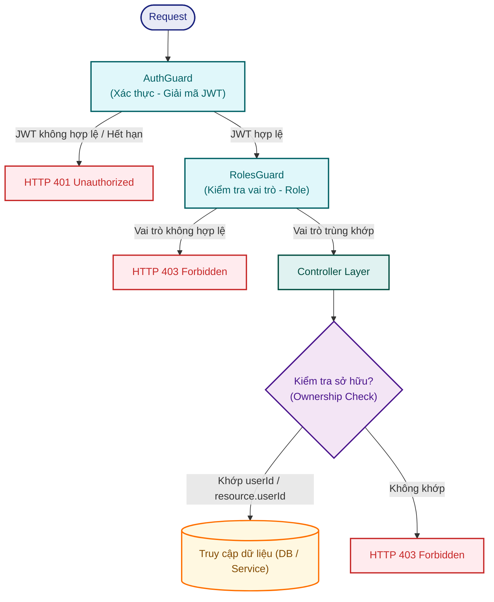

1. **AuthGuard (Global):**
   - Kiểm tra chữ ký (signature) và thời gian hết hạn (expiration) của JWT.
   - Trích xuất thông tin người dùng từ payload: `{ userId, email, role }`.
   - Tiêm thông tin vào đối tượng request làm `request.user`.

2. **RolesGuard (Per-route):**
   - Sử dụng Decorator `@Roles('organizer', 'gate_staff')` trên controller hoặc endpoint method.
   - So sánh `request.user.role` với danh sách quyền tối thiểu được chỉ định.
   - Nếu không khớp, chặn yêu cầu và trả về lỗi `HTTP 403 Forbidden`.

3. **Kiểm tra quyền sở hữu tài nguyên (Ownership Check - Service Level):**
   - Khán giả chỉ có quyền đọc/ghi các tài nguyên liên quan tới chính tài khoản của họ (booking, ticket, notification).
   - So sánh `request.user.userId === resource.userId` trước khi thực hiện thao tác cơ sở dữ liệu.

---

## Thiết kế các cơ chế bảo vệ hệ thống

### Kiểm soát tải đột biến (Rate Limiting)

#### Các phương án cân nhắc

| #   | Phương án                                                          | Mô tả                                                                                                                                                                                                                                                                                            |
| --- | ------------------------------------------------------------------ | ------------------------------------------------------------------------------------------------------------------------------------------------------------------------------------------------------------------------------------------------------------------------------------------------ |
| A   | **Single-Layer Rate Limiting (chỉ tại Application)**               | Toàn bộ logic rate limiting (theo IP và User ID) được xử lý tại tầng ứng dụng NestJS bằng Token Bucket trên Redis. Mọi request đều đi qua Nginx (chỉ proxy), vào NestJS, parse JWT, rồi mới kiểm tra giới hạn.                                                                                  |
| B   | **Two-Tiered Rate Limiting (API Gateway + Application)**           | Chia rate limiting thành 2 lớp phòng thủ: Lớp 1 tại API Gateway (Nginx) chặn theo IP bằng Token Bucket in-memory để phòng thủ diện rộng (DDoS, Bot). Lớp 2 tại NestJS chặn theo User ID bằng Sliding Window Counter trên Redis để bảo vệ nghiệp vụ (chống đầu cơ vé).                            |
| C   | **Thay Nginx bằng Kong API Gateway**                               | Sử dụng Kong (API Gateway chuyên dụng) thay thế Nginx, tận dụng plugin rate-limiting có sẵn hỗ trợ nhiều tiêu chí (IP, Consumer, Header). Kong cần thêm PostgreSQL/Cassandra riêng để lưu cấu hình hoặc chạy DB-less mode.                                                                       |

#### Đánh giá

| Tiêu chí                               | Single-Layer (NestJS only)                                                                               | Two-Tiered (Nginx + NestJS)                                                                                             | Kong API Gateway                                                            |
| --------------------------------------- | -------------------------------------------------------------------------------------------------------- | ----------------------------------------------------------------------------------------------------------------------- | --------------------------------------------------------------------------- |
| Bảo vệ hạ tầng trước DDoS              | ❌ Yếu — request vẫn phải vào NestJS, parse header, kết nối Redis mới bị chặn. Nguy cơ nghẽn Event Loop | ✅ Mạnh — Nginx chặn ngay tại rìa hệ thống (Edge), xử lý bằng C native, không tiêu tốn tài nguyên NestJS               | ✅ Mạnh — Kong xử lý tại Gateway, tương tự Nginx                            |
| Chống gian lận đặt vé (theo User ID)   | ⚠️ Có nhưng lẫn lộn cùng lớp với IP check                                                               | ✅ Tách biệt rõ ràng — Lớp 2 khóa cứng theo User ID trên Redis, bất kể user đổi IP (VPN/Proxy)                         | ✅ Có plugin hỗ trợ, nhưng cần cấu hình JWT plugin kèm theo                 |
| Độ phức tạp hạ tầng                     | ✅ Đơn giản — chỉ cần NestJS + Redis                                                                     | ✅ Thấp — Nginx đã có sẵn trong kiến trúc, chỉ thêm 5 dòng config `limit_req`                                           | ❌ Cao — cần thêm container Kong + DB riêng (PostgreSQL/Cassandra), ~150MB   |
| Phù hợp quy mô đồ án (team nhỏ)        | ✅ Rất phù hợp                                                                                           | ✅ Phù hợp — không tăng độ phức tạp vận hành                                                                             | ❌ Over-engineering cho Modular Monolith                                     |
| Khả năng mở rộng sau này               | ⚠️ Hạn chế — mọi thứ gói trong NestJS                                                                   | ✅ Tốt — nếu cần chuyển sang Kong sau, chỉ thay Nginx                                                                   | ✅ Rất tốt — plugin ecosystem phong phú                                     |

#### Chốt giải pháp: Phương án B — Two-Tiered Rate Limiting (Nginx + NestJS)

**Lý do:**

- **Nginx đã có sẵn** trong kiến trúc Container Diagram với vai trò Reverse Proxy — chỉ cần bổ sung cấu hình `limit_req`, không thêm container hay dependency mới.
- **Tách biệt trách nhiệm rõ ràng:** Lớp 1 (Nginx) chỉ lo chặn IP bất hợp pháp bằng native C module (`ngx_http_limit_req_module`) với tốc độ nano-giây, không tiêu tốn tài nguyên NestJS. Lớp 2 (NestJS) chỉ lo bảo vệ nghiệp vụ theo User ID sau khi đã decode JWT.
- **Kong là over-engineering** cho Modular Monolith: chỉ có 1 NestJS app phía sau, không cần hệ sinh thái plugin phức tạp. Nếu sau này chuyển sang Microservices, có thể nâng cấp từ Nginx lên Kong mà không cần tái cấu trúc.

#### Kiến trúc 2 lớp Rate Limiting

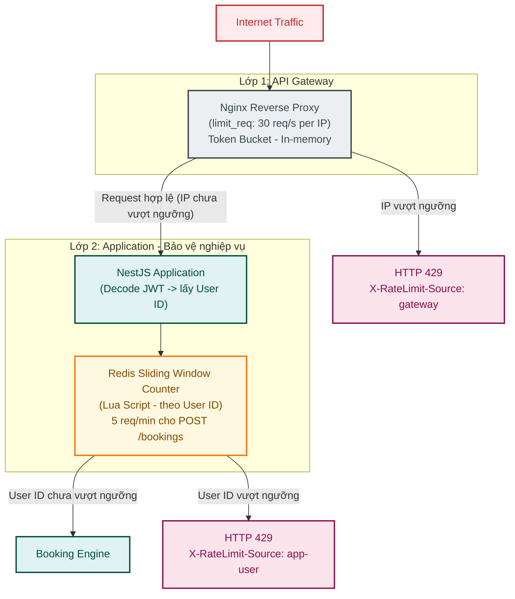

#### Lớp 1 — API Gateway (Nginx `limit_req`)

**Mục đích:** Phòng thủ diện rộng (Global Protection). Chặn các cuộc tấn công DDoS, bot cào dữ liệu, hoặc người dùng nhấn F5 liên tục trước khi request chạm tới NestJS Application.

**Thuật toán:** Token Bucket (Leaky Bucket variant) — module native `ngx_http_limit_req_module`, xử lý hoàn toàn trong shared memory của Nginx, không cần Redis.

**Cấu hình Nginx:**

```nginx
# Khai báo zone: 10MB shared memory, 30 req/s per IP
limit_req_zone $binary_remote_addr zone=global:10m rate=30r/s;

server {
    location / {
        # burst=10: cho phép burst tối đa 10 request trước khi reject
        # nodelay: xử lý burst ngay lập tức, không queue chờ
        limit_req zone=global burst=10 nodelay;
        limit_req_status 429;

        # Trả về JSON thay vì HTML mặc định của Nginx
        error_page 429 = @rate_limit_exceeded;

        proxy_pass http://nestjs_app;
    }

    location @rate_limit_exceeded {
        default_type application/json;
        add_header X-RateLimit-Source "gateway" always;
        return 429 '{"statusCode":429,"message":"Too many requests. Please slow down."}';
    }
}
```

| Tham số      | Giá trị        | Ý nghĩa                                                              |
| ------------ | -------------- | -------------------------------------------------------------------- |
| `rate`       | `30r/s`        | Tối đa 30 request/giây cho mỗi IP address                            |
| `burst`      | `10`           | Cho phép burst thêm 10 request vượt ngưỡng (phù hợp người dùng thật) |
| `nodelay`    | —              | Xử lý burst ngay, không delay/queue                                   |
| `zone`       | `global:10m`   | 10MB shared memory (~160,000 IP addresses đồng thời)                  |

#### Lớp 2 — Application Layer (Redis Sliding Window Counter)

**Mục đích:** Bảo vệ nghiệp vụ chuyên sâu (Business Logic Protection). Ngăn chặn một tài khoản (User ID) lách luật bằng cách mở nhiều tab, dùng VPN đổi IP, hoặc viết script gửi đồng thời hàng loạt request đặt vé.

**Thuật toán:** Sliding Window Counter trên Redis — sử dụng Lua Script với Sorted Set (`ZSET`) để đếm chính xác số request trong cửa sổ thời gian trượt, triệt tiêu hiện tượng burst tại ranh giới window mà Fixed Window mắc phải.

**Chỉ áp dụng cho các endpoint nhạy cảm:**

| Endpoint                      | Window   | Max Requests | Áp dụng theo | Lý do                                                 |
| ----------------------------- | -------- | ------------ | ------------- | ----------------------------------------------------- |
| `POST /bookings` (đặt vé)     | 1 phút   | 5            | User ID       | Chống script spam đặt chỗ hàng loạt                   |
| `POST /payments` (thanh toán) | 1 phút   | 3            | User ID       | Chống gửi request thanh toán lặp lại                  |

> **Lưu ý:** Endpoint đọc dữ liệu (`GET /concerts`) **không cần** rate limit ở Lớp 2 vì đã được bảo vệ bởi Nginx (Lớp 1) và CDN Cache.

**Redis Lua Script — Sliding Window Counter:**

```lua
-- KEYS[1] = rate_limit:{user_id}:{endpoint}
-- ARGV[1] = now (timestamp hiện tại, milliseconds)
-- ARGV[2] = window_size (kích thước cửa sổ, milliseconds, ví dụ: 60000 = 1 phút)
-- ARGV[3] = max_requests (số request tối đa trong window)

local key = KEYS[1]
local now = tonumber(ARGV[1])
local window = tonumber(ARGV[2])
local max_req = tonumber(ARGV[3])

-- 1. Xóa các bản ghi cũ nằm ngoài cửa sổ thời gian
redis.call('ZREMRANGEBYSCORE', key, 0, now - window)

-- 2. Đếm số request hiện tại trong cửa sổ
local current = redis.call('ZCARD', key)

if current >= max_req then
    return 0  -- VƯỢT NGƯỠNG → chặn
end

-- 3. Ghi nhận request mới (score = timestamp, member = unique ID)
redis.call('ZADD', key, now, now .. ':' .. math.random(1000000))

-- 4. Đặt TTL tự động dọn dẹp key khi hết window
redis.call('PEXPIRE', key, window)

return 1  -- CHO PHÉP
```

**Key Pattern trên Redis:**

| Key Pattern                                | Kiểu         | Mô tả                                    |
| ------------------------------------------ | ------------ | ---------------------------------------- |
| `rate_limit:{user_id}:bookings`            | Sorted Set   | Đếm số lần đặt vé trong 1 phút          |
| `rate_limit:{user_id}:payments`            | Sorted Set   | Đếm số lần thanh toán trong 1 phút       |

**Hành vi khi vượt ngưỡng:** Trả về `HTTP 429 Too Many Requests` kèm header `X-RateLimit-Source: app-user` và `Retry-After` (giây) để client phân biệt với lỗi 429 từ Nginx Gateway.

---

### Xử lý cổng thanh toán không ổn định (Circuit Breaker)

#### Các phương án cân nhắc

| #   | Phương án                                | Mô tả                                                                                                                              |
| --- | ---------------------------------------- | ---------------------------------------------------------------------------------------------------------------------------------- |
| A   | **Retry đơn giản (Exponential Backoff)** | Khi gọi payment API lỗi, tự động retry với khoảng cách tăng dần (1s → 2s → 4s).                                                    |
| B   | **Circuit Breaker Pattern**              | Theo dõi tỷ lệ lỗi. Khi vượt ngưỡng → cắt mạch (Open), ngừng gọi API lỗi, chuyển sang fallback. Sau timeout → thử lại (Half-Open). |
| C   | **Bulkhead Pattern**                     | Giới hạn số concurrent connections tới payment gateway, tránh một gateway lỗi kéo sập toàn hệ thống.                               |

#### Đánh giá

| Tiêu chí               | Retry                               | Circuit Breaker             | Bulkhead                  |
| ---------------------- | ----------------------------------- | --------------------------- | ------------------------- |
| Ngăn cascade failure   | ❌ Retry liên tục có thể làm tệ hơn | ✅ Cắt mạch ngay            | ⚠️ Giới hạn nhưng vẫn gọi |
| Phát hiện lỗi hệ thống | ❌ Không                            | ✅ Tracking tỷ lệ lỗi       | ❌ Không                  |
| Tự phục hồi            | ❌ Phải retry thủ công              | ✅ Half-Open → auto-recover | ❌ Không                  |
| Thư viện NestJS        | ✅ axios-retry                      | ✅ opossum                  | ⚠️ Cần tự viết            |

#### Chốt giải pháp: Circuit Breaker kết hợp Graceful Degradation (Dynamic Switch & Read-Only Failover)

**Lý do:** 
- **Tách biệt bảo vệ:** Hệ thống sử dụng hai Circuit Breaker độc lập (`vnpayCircuitBreaker` và `momoCircuitBreaker` sử dụng thư viện `opossum`) cho từng cổng thanh toán trực tuyến. Điều này tránh việc sự cố của cổng này ảnh hưởng đến cổng khác.
- **Graceful Degradation (Read-Only Failover):** 
  - *Dynamic Switch:* Khi một cổng thanh toán bị sập (Circuit Breaker chuyển sang trạng thái `OPEN`), hệ thống tự động điều hướng người dùng sang cổng thanh toán còn lại.
  - *Read-Only Failover:* Khi cả hai cổng thanh toán đều sập, hệ thống chặn hoàn toàn việc tạo đơn hàng mới (`POST /bookings` trả về lỗi `HTTP 503 Service Unavailable` hoặc thông báo bảo trì thanh toán) nhằm bảo vệ kho vé khỏi tình trạng bot/người dùng ảo chiếm dụng (giữ vé ma). Tuy nhiên, các API đọc thông tin sự kiện (`GET /concerts/:id` và `GET /stagemap`) vẫn mở bình thường từ Redis Cache để khán giả vẫn xem được chi tiết sự kiện và sơ đồ ghế.

**Cấu hình Circuit Breaker cho từng cổng (`vnpayCircuitBreaker`, `momoCircuitBreaker`):**

| Tham số                    | Giá trị | Ý nghĩa                                       |
| -------------------------- | ------- | --------------------------------------------- |
| `errorThresholdPercentage` | 50%     | Cắt mạch khi >50% request lỗi                 |
| `resetTimeout`             | 30 giây | Thời gian chờ trước khi chuyển sang Half-Open |
| `rollingCountTimeout`      | 10 giây | Cửa sổ thống kê lỗi                           |
| `volumeThreshold`          | 5       | Số request tối thiểu trước khi tính tỷ lệ     |

**Cấu hình Retry (bên trong mỗi Circuit Breaker):**

| Tham số          | Giá trị   | Ý nghĩa                                                                 |
| ---------------- | --------- | ----------------------------------------------------------------------- |
| `maxRetries`     | 2         | Tối đa retry 2 lần trước khi tính là failure                            |
| `retryDelay`     | 1s → 2s   | Exponential Backoff — tránh đánh dồn gateway khi đang quá tải           |
| `retryCondition` | 5xx, ETIMEDOUT | Chỉ retry khi lỗi server hoặc timeout, không retry với 4xx (lỗi client) |

**State Machine của Circuit Breaker:**

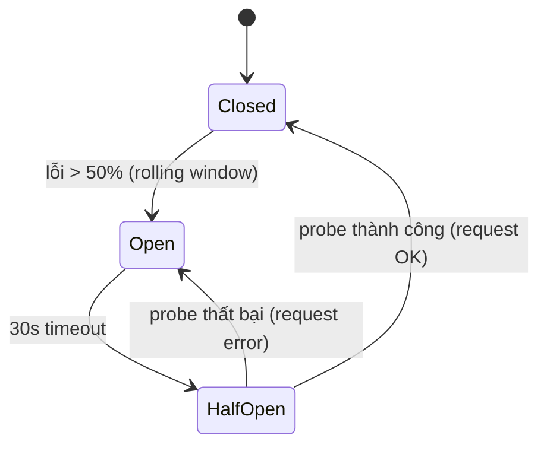

**Cơ chế Failover & Fallback:**

1. **Endpoint kiểm tra trạng thái cổng (`GET /payments/methods`):**
   - API này kiểm tra trạng thái của cả hai Circuit Breakers.
   - Nếu `vnpayCircuitBreaker` ở trạng thái `OPEN`, trường `available` của VNPAY sẽ trả về `false`. Frontend sẽ tự động ẩn hoặc disable tùy chọn này và gợi ý MoMo.
   - Nếu cả hai cổng đều `OPEN`, Frontend sẽ hiển thị thông báo cổng thanh toán đang bảo trì và tạm thời khóa nút đặt vé.

2. **Luồng xử lý Booking API (`POST /bookings`):**
   - Trước khi cho phép tạo đơn hàng và giữ chỗ, hệ thống kiểm tra trạng thái của cả hai Circuit Breakers.
   - Nếu cả hai cổng đều `OPEN` (sập toàn bộ): Trả về `HTTP 503 Service Unavailable` kèm thông báo bảo trì thanh toán, chặn tạo đơn hàng mới.

3. **Luồng xử lý Checkout API (`POST /payments`):**
   - Khi nhận yêu cầu thanh toán cho một phương thức (ví dụ: VNPAY):
     - Nếu CB của cổng đó là `CLOSED` hoặc `HALF-OPEN`: Thực hiện gọi API của gateway bình thường.
     - Nếu CB của cổng đó là `OPEN`: API tự động kiểm tra xem cổng còn lại (MoMo) có khả dụng hay không.
       - *Trường hợp cổng còn lại khả dụng (Strategy 1):* Trả về `HTTP 422 Unprocessable Entity` gợi ý người dùng đổi sang cổng khả dụng.
       - *Trường hợp cả hai cổng đều sập (Strategy 2):* Trả về `HTTP 503 Service Unavailable` thông báo hệ thống thanh toán đang bảo trì.

#### Luồng xử lý thanh toán thông minh (Sequence Diagram)

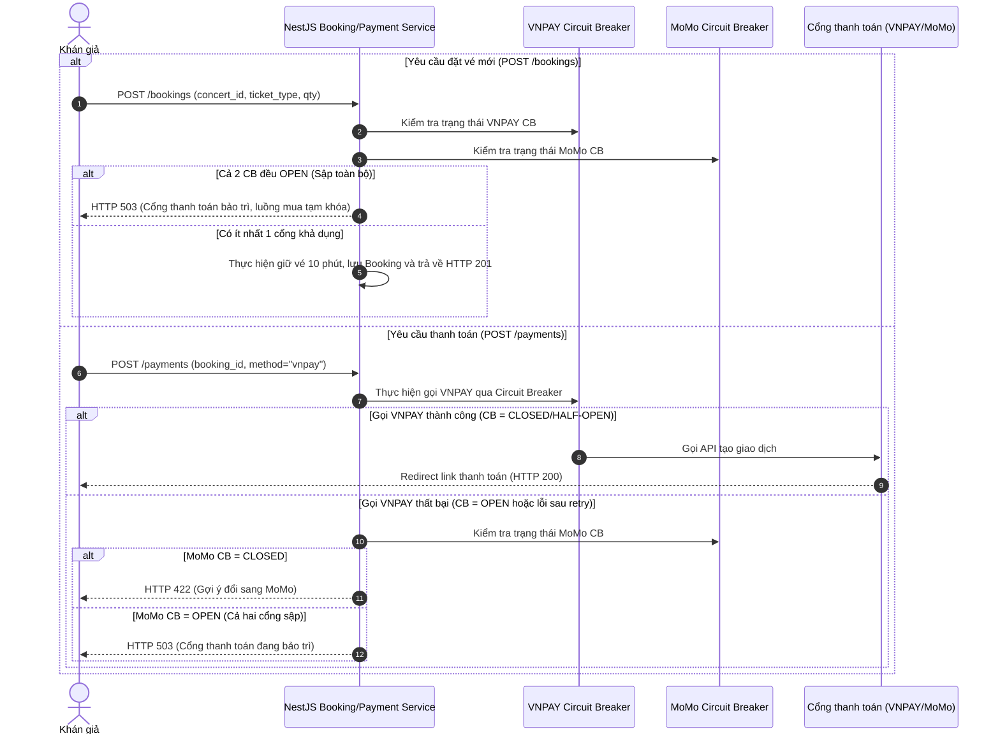

**Hành vi khi sập toàn bộ cổng:** Khi cả hai Circuit Breaker đều `OPEN`, hệ thống kích hoạt chế độ bảo trì luồng mua vé. Mọi yêu cầu tạo đơn hàng mới (`POST /bookings`) và yêu cầu thanh toán (`POST /payments`) đều bị chặn với lỗi `HTTP 503 Service Unavailable`. Các API đọc thông tin như `GET /concerts/:id` và `GET /stagemap` vẫn hoạt động bình thường qua Redis Cache để khán giả xem thông tin sự kiện và sơ đồ ghế.

---

### Chống trừ tiền hai lần (Idempotency Key)

#### Các phương án cân nhắc

| #   | Phương án                        | Mô tả                                                                                                    |
| --- | -------------------------------- | -------------------------------------------------------------------------------------------------------- |
| A   | **Database Unique Constraint**   | Lưu `idempotency_key` làm cột UNIQUE trong bảng bookings. DB tự chặn insert trùng.                       |
| B   | **Redis Lock + Cached Response** | Lưu `idempotency_key` trong Redis với TTL. Kiểm tra trước khi xử lý. Nếu đã xử lý → trả cached response. |
| C   | **Middleware + Database**        | Bảng riêng `idempotency_keys` lưu key + response + status. Check trước mỗi request.                      |

#### Đánh giá

| Tiêu chí                     | DB Unique                           | Redis Lock               | Middleware + DB      |
| ---------------------------- | ----------------------------------- | ------------------------ | -------------------- |
| Tốc độ kiểm tra              | ❌ Chậm (disk I/O)                  | ✅ Rất nhanh (in-memory) | ❌ Chậm              |
| Tự động expire               | ❌ Cần cleanup job                  | ✅ Redis TTL tự expire   | ❌ Cần cleanup job   |
| Trả lại cached response      | ❌ Chỉ chặn duplicate               | ✅ Lưu response kèm key  | ✅ Lưu response      |
| Phát hiện request đang xử lý | ❌ Không (chỉ biết khi insert fail) | ✅ SET NX → biết ngay    | ⚠️ Cần status column |

#### Chốt giải pháp: Phương án B — Redis Lock + Cached Response

**Lý do:** Dưới tải cao, kiểm tra trùng lặp phải **nhanh** (microseconds, không phải milliseconds). Redis `SET NX` (Set if Not Exists) cho phép kiểm tra + lock trong 1 thao tác nguyên tử. Cached response cho phép trả kết quả ngay mà không chạy lại giao dịch.

**Luồng xử lý:**

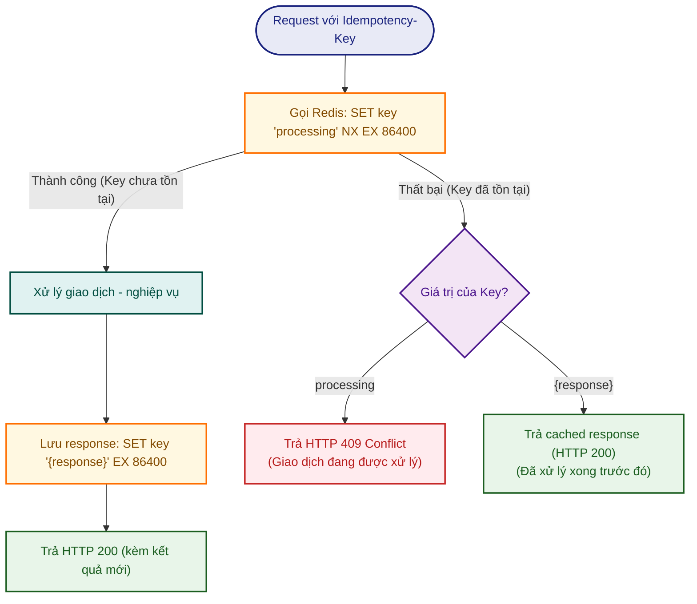

**TTL:** 24 giờ — đủ dài để cover retry trong session, đủ ngắn để không tốn memory Redis.

---

### Caching (Cache-aside với Redis)

#### Các phương án cân nhắc

| #   | Phương án                      | Mô tả                                                                                                   |
| --- | ------------------------------ | ------------------------------------------------------------------------------------------------------- |
| A   | **Cache-aside (Lazy Loading)** | App đọc cache trước. Cache miss → đọc DB → ghi cache. Cache hit → trả về. Invalidate khi data thay đổi. |
| B   | **Write-through**              | Mỗi lần ghi DB, đồng thời ghi cache. Đọc luôn từ cache.                                                 |
| C   | **Write-back (Write-behind)**  | Ghi vào cache trước, DB được cập nhật bất đồng bộ sau.                                                  |

#### Đánh giá

| Tiêu chí                    | Cache-aside                      | Write-through        | Write-back                 |
| --------------------------- | -------------------------------- | -------------------- | -------------------------- |
| Đơn giản triển khai         | ✅ Đơn giản                      | ⚠️ Trung bình        | ❌ Phức tạp (cần queue)    |
| Cache luôn fresh            | ⚠️ Có window stale (TTL)         | ✅ Luôn sync         | ✅ Luôn có trong cache     |
| Tải lên DB khi ghi          | ✅ Ghi thẳng DB                  | ✅ Ghi cả DB + cache | ⚠️ DB có thể lag           |
| Rủi ro mất data             | ✅ Không (DB là source of truth) | ✅ Không             | ❌ Cache crash → mất data  |
| Phù hợp read-heavy workload | ✅ Rất phù hợp                   | ✅ Phù hợp           | ⚠️ Phù hợp write-heavy hơn |

#### Chốt giải pháp: Cache-aside (Phương án A)

**Lý do:** Hệ thống có workload **read-heavy** (xem danh sách concert, chi tiết concert) chiếm >90% traffic. Cache-aside đơn giản, DB luôn là source of truth, và phù hợp nhất cho pattern này. Write-through không cần thiết vì concert info thay đổi không thường xuyên.

**Đối tượng cache và cấu hình:**

| Đối tượng              | Redis Key Pattern                         | TTL       | Invalidation Strategy                                 |
| ---------------------- | ----------------------------------------- | --------- | ----------------------------------------------------- |
| Danh sách concert      | `cache:concerts:list:{page}`              | 10 phút   | Xóa key khi admin tạo/sửa/xóa concert                 |
| Chi tiết concert       | `cache:concerts:{id}`                     | 10 phút   | Xóa key khi admin sửa concert                         |
| Sơ đồ sân khấu (SVG)  | `cache:concerts:{id}:stagemap`            | 30 phút   | Xóa khi admin cập nhật sơ đồ sân khấu                 |
| Số vé còn lại          | `inventory:{concert_id}:{ticket_type_id}` | Không TTL | Luôn chính xác vì Lua Script trừ trực tiếp trên Redis |

**Lưu ý đặc biệt — Số vé còn lại:** Đây không phải cache thông thường. Giá trị tồn kho trên Redis **là source of truth** cho luồng đặt vé (Lua Script trừ trực tiếp), không phải bản sao của DB. Reconciliation Job đối soát Redis ↔ PostgreSQL mỗi 15 phút để xử lý edge case.

**Lưu ý đặc biệt — Sơ đồ sân khấu (SVG Stage Map):**

Trường `svg_stage_map` lưu trữ nội dung SVG sơ đồ sân khấu trực tiếp trong PostgreSQL dưới dạng `TEXT`. Kích thước mỗi SVG có thể dao động từ **50KB đến 500KB+**. Khi có hàng ngàn lượt truy cập xem chi tiết concert cùng lúc (đặc biệt trong thời điểm mở bán vé hot), việc đọc trường TOAST nặng này từ PostgreSQL cho mỗi request sẽ gây quá tải I/O.

**Chiến lược tách key riêng:** SVG stage map được cache trong Redis **tách biệt** khỏi object concert chính, sử dụng key pattern `cache:concerts:{id}:stagemap`. Lý do:

- **Tiết kiệm memory Redis:** API `GET /concerts/:id` (xem thông tin concert) trả về object nhẹ (~2KB) từ `cache:concerts:{id}` mà không kéo theo SVG nặng ~200KB. SVG chỉ được load khi user thực sự xem sơ đồ sân khấu (`GET /concerts/:id/stagemap`).
- **TTL tối ưu hóa riêng:** Sơ đồ sân khấu gần như cố định sau khi được tạo — admin hiếm khi thay đổi. TTL 30 phút (dài hơn 3x so với concert info) giúp giảm ~95% DB reads cho trường nặng nhất.
- **Invalidation đơn giản:** Khi admin cập nhật sơ đồ → `DEL cache:concerts:{id}:stagemap`. Key sẽ tự được populate lại ở lần đọc tiếp theo (lazy loading).

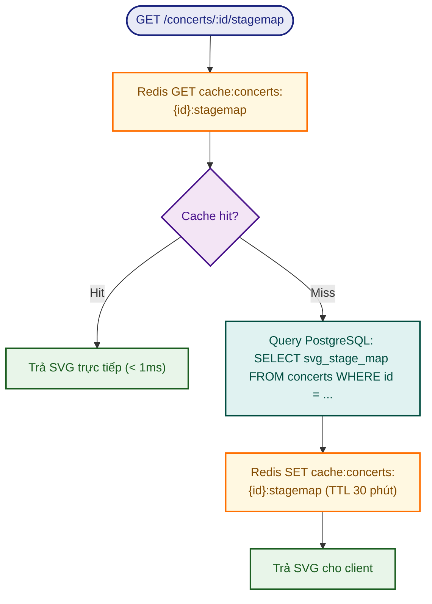

---

## Chiến lược xử lý High Concurrency

### Các phương án cân nhắc

| #   | Phương án                                                           | Mô tả                                                                                                                                                    |
| --- | ------------------------------------------------------------------- | -------------------------------------------------------------------------------------------------------------------------------------------------------- |
| A   | **PostgreSQL SELECT FOR UPDATE (Pessimistic Locking)**              | Lock row tồn kho trong DB khi đặt vé, giảm `available_quantity`, commit. Các request khác phải chờ lock release.                                         |
| B   | **PostgreSQL Optimistic Locking (Version Column)**                  | Đọc tồn kho + version number, khi ghi kiểm tra version khớp. Nếu không khớp → retry.                                                                     |
| C   | **Redis Lua Script (Atomic In-Memory) + RabbitMQ (Async DB Write)** | Redis xử lý trừ tồn kho + kiểm tra per-user limit nguyên tử trong memory. Giao dịch hợp lệ được đẩy vào RabbitMQ, worker ghi vào PostgreSQL bất đồng bộ. |

### Đánh giá

| Tiêu chí                         | Pessimistic Lock (PG)                             | Optimistic Lock (PG)                                | Redis Lua + RabbitMQ                       |
| -------------------------------- | ------------------------------------------------- | --------------------------------------------------- | ------------------------------------------ |
| Throughput dưới tải 1000 req/s   | ❌ Nghẽn connection pool, row lock contention cao | ⚠️ Retry storm khi contention cao → throughput giảm | ✅ Redis single-threaded xử lý ~100K ops/s |
| Consistency                      | ✅ Strong (DB-level lock)                         | ✅ Strong (version check)                           | ✅ Strong (Lua script atomic)              |
| DB load                          | ❌ Mỗi request = 1 transaction                    | ❌ Mỗi request = 1+ transaction (retry)             | ✅ DB chỉ nhận write từ worker tuần tự     |
| Phức tạp triển khai              | ✅ Đơn giản                                       | ⚠️ Cần retry logic                                  | ⚠️ Cần Redis + RabbitMQ + Lua Script       |
| Kiểm tra per-user limit cùng lúc | ⚠️ Cần thêm query trong cùng transaction          | ⚠️ Phức tạp hơn khi kết hợp                         | ✅ Kiểm tra trong cùng Lua Script          |

### Chốt giải pháp: Phương án C — Redis Lua Script + RabbitMQ

**Lý do:** Với peak load 1,000 booking requests/giây, PostgreSQL sẽ bị nghẽn connection pool nếu mỗi request đều lock row. Redis xử lý single-threaded nên **Lua Script chạy nguyên tử tự nhiên** (không cần lock), throughput đạt ~100K ops/s — dư sức cho bài toán này. RabbitMQ đệm các booking task để worker ghi vào DB tuần tự, PostgreSQL không bao giờ chịu tải đột biến trực tiếp.

### Chi tiết triển khai

#### Quy trình luồng đặt vé (Sequence Diagram)

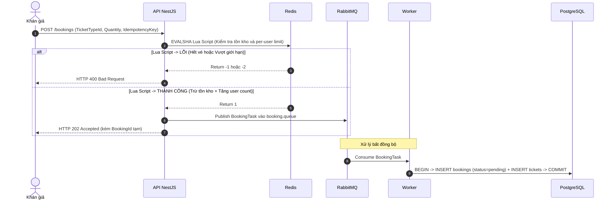

#### Redis Data Structures

| Key Pattern                               | Kiểu             | Mô tả                     |
| ----------------------------------------- | ---------------- | ------------------------- |
| `inventory:{concert_id}:{ticket_type_id}` | String (integer) | Số vé còn lại             |
| `user_tickets:{user_id}:{ticket_type_id}` | String (integer) | Số vé user đã mua/giữ chỗ |

#### Lua Script — Đặt vé nguyên tử

```lua
local inventory_key = KEYS[1]      -- inventory:{concert_id}:{ticket_type_id}
local user_key = KEYS[2]           -- user_tickets:{user_id}:{ticket_type_id}
local requested_qty = tonumber(ARGV[1])
local max_per_user = tonumber(ARGV[2])

-- 1. Kiểm tra tồn kho
local available = tonumber(redis.call('GET', inventory_key))
if not available or available < requested_qty then
    return -1  -- HẾT VÉ
end

-- 2. Kiểm tra giới hạn per-user
local purchased = tonumber(redis.call('GET', user_key) or "0")
if (purchased + requested_qty) > max_per_user then
    return -2  -- VƯỢT GIỚI HẠN
end

-- 3. Trừ tồn kho + Tăng user count (nguyên tử)
redis.call('DECRBY', inventory_key, requested_qty)
redis.call('INCRBY', user_key, requested_qty)

return 1  -- THÀNH CÔNG
```

#### Lua Script — Hồi kho khi đơn hàng hết hạn (Compensation)

```lua
-- Gọi khi đơn pending quá 10 phút hoặc user hủy đơn
redis.call('INCRBY', KEYS[1], ARGV[1])  -- Trả lại tồn kho
redis.call('DECRBY', KEYS[2], ARGV[1])  -- Giảm user count
```

#### Cron Job hủy đơn hết hạn

- NestJS `@Cron('*/1 * * * *')` quét mỗi phút.
- Query: `SELECT * FROM bookings WHERE status = 'pending' AND expires_at < NOW()`
- Với mỗi booking hết hạn: cập nhật `status = 'expired'`, chạy Lua Script hồi kho trên Redis.

---

## Soát vé Ngoại tuyến (Offline Check-in)

### Thiết kế tổng quan

Sân vận động và nhà thi đấu thường mất sóng khi đông người. Hệ thống soát vé phải hoạt động **hoàn toàn offline** trên thiết bị di động và đồng bộ lại khi có mạng.

### Luồng hoạt động

```mermaid
flowchart TD
    classDef app fill:#e8eaf6,stroke:#1a237e,stroke-width:2px,color:#1a237e;
    classDef api fill:#e0f7fa,stroke:#006064,stroke-width:2px,color:#006064;
    classDef db fill:#fff8e1,stroke:#ff6f00,stroke-width:2px,color:#824a00;
    classDef verify fill:#f3e5f5,stroke:#4a148c,stroke-width:2px,color:#4a148c;
    classDef alert fill:#ffebee,stroke:#c62828,stroke-width:2px,color:#b71c1c;
    classDef success fill:#e8f5e9,stroke:#1b5e20,stroke-width:2px,color:#1b5e20;

    subgraph Phase1["Giai đoạn 1: Trước sự kiện (Có mạng)"]
        A[Mobile App]:::app -->|"GET /checkin/data"| B[API Server]:::api
        B -->|"Trả danh sách vé hợp lệ<br/>(ticket_id, qr_code_hash, status)"| A
        A -->|"Lưu danh sách vé"| SQLite[("SQLite cục bộ")]:::app
    end

    subgraph Phase2["Giai đoạn 2: Tại cổng sự kiện (Mất mạng)"]
        Scan[Quét QR Code]:::app --> Verify{"Xác thực HMAC-SHA256<br/>(dùng SERVER_SECRET)"}:::verify
        Verify -->|"Chữ ký không hợp lệ"| Reject["Từ chối (Vé giả)"]:::alert
        Verify -->|"Chữ ký hợp lệ"| QuerySQL{"Tra cứu SQLite cục bộ"}:::verify
        QuerySQL -->|"Chưa check-in"| MarkChecked["Đánh dấu checked_in<br/>Lưu log vào Offline Queue"]:::app
        MarkChecked --> Approve["VÉ HỢP LỆ"]:::success
        QuerySQL -->|"Đã check-in"| Duplicate["VÉ ĐÃ SỬ DỤNG"]:::alert
    end

    subgraph Phase3["Giai đoạn 3: Khi có mạng trở lại (Background Sync)"]
        App[Mobile App Queue]:::app -->|"POST /checkin/sync"| API[API Server]:::api
        API -->|"Đối soát trạng thái vé"| PG[("PostgreSQL")]:::db
        PG -->|"Chưa check-in trên Server"| SyncSuccess["Cập nhật checked_in - ghi checkin_logs"]:::success
        PG -->|"Đã check-in trên Server từ trước"| SyncAlert["Đánh dấu TRÙNG LẶP - cảnh báo gian lận"]:::alert
    end
```

### QR Code ký số bảo mật (HMAC-SHA256)

#### Các phương án cân nhắc

| #   | Phương án                               | Mô tả                                                                                    |
| --- | --------------------------------------- | ---------------------------------------------------------------------------------------- |
| A   | **Simple Hash (SHA-256 của ticket_id)** | QR chứa ticket_id + SHA-256(ticket_id). App verify bằng cách tính lại hash.              |
| B   | **HMAC-SHA256 với Server Secret**       | QR chứa payload + HMAC-SHA256(payload, SERVER_SECRET). Chỉ ai có secret mới verify được. |
| C   | **RSA Digital Signature (Asymmetric)**  | Server ký bằng private key, app verify bằng public key. Không cần chia sẻ secret.        |

#### Đánh giá

| Tiêu chí                          | Simple Hash               | HMAC-SHA256                   | RSA Signature                   |
| --------------------------------- | ------------------------- | ----------------------------- | ------------------------------- |
| Chống giả mạo                     | ❌ Ai cũng tính được hash | ✅ Cần biết secret            | ✅ Cần private key              |
| Tốc độ verify                     | ✅ Rất nhanh              | ✅ Rất nhanh                  | ⚠️ Chậm hơn (asymmetric crypto) |
| Kích thước signature              | 32 bytes                  | 32 bytes                      | 256+ bytes (RSA-2048)           |
| Cần chia sẻ secret cho mobile app | —                         | ⚠️ Cần embed secret trong app | ✅ Chỉ cần public key           |
| Phức tạp triển khai               | ✅ Đơn giản               | ✅ Đơn giản                   | ⚠️ Cần quản lý key pair         |

#### Chốt giải pháp: HMAC-SHA256 (Phương án B)

**Lý do:** Cân bằng tốt giữa bảo mật và đơn giản. Simple Hash không đủ bảo mật (ai cũng tạo được vé giả). RSA quá nặng cho mobile app quét hàng nghìn vé. HMAC-SHA256 nhanh, gọn (32 bytes), và đủ bảo mật — secret được embed trong mobile app (chấp nhận được vì app chỉ dành cho nhân viên soát vé nội bộ, không phát hành công khai).

**Quy trình sinh QR Code:**

1. Tạo payload: `{ ticket_id, booking_id, ticket_type, issued_at }`
2. Ký: `signature = HMAC-SHA256(JSON.stringify(payload), SERVER_SECRET)`
3. Nội dung QR: `base64url(JSON.stringify({ ...payload, sig: signature }))`
4. Sinh ảnh QR PNG bằng thư viện `qrcode` (npm)
5. Lưu hash vào trường `qr_code_hash` trong bảng `tickets`

---

## Hệ thống Thông báo (Notification Architecture)

### Kiến trúc Message Exchange

#### Các phương án cân nhắc

| #   | Phương án           | Mô tả                                                                                                                                      |
| --- | ------------------- | ------------------------------------------------------------------------------------------------------------------------------------------ |
| A   | **Direct Exchange** | Publisher gửi message trực tiếp tới queue cụ thể. Cần gửi N message cho N kênh.                                                            |
| B   | **Fanout Exchange** | Publisher gửi 1 message, exchange broadcast tới tất cả queue bind vào nó. Không phân biệt loại event.                                      |
| C   | **Topic Exchange**  | Publisher gửi 1 message với routing key (ví dụ: `notification.booking.confirmed`). Mỗi queue bind theo pattern → chỉ nhận message phù hợp. |

#### Đánh giá

| Tiêu chí                                     | Direct Exchange        | Fanout Exchange     | Topic Exchange                    |
| -------------------------------------------- | ---------------------- | ------------------- | --------------------------------- |
| Publisher biết về receivers                  | ❌ Phải biết mọi queue | ✅ Không cần biết   | ✅ Không cần biết                 |
| Thêm kênh mới mà không sửa publisher         | ❌ Phải sửa publisher  | ✅ Chỉ thêm queue   | ✅ Chỉ thêm queue + bind pattern  |
| Routing theo loại event                      | ❌ Không               | ❌ Broadcast tất cả | ✅ Routing linh hoạt theo pattern |
| Kênh A nhận event X, kênh B chỉ nhận event Y | ❌ Không               | ❌ Không            | ✅ Có (bind pattern khác nhau)    |

#### Chốt giải pháp: Topic Exchange (Phương án C)

**Lý do:** Đáp ứng yêu cầu **"dễ dàng bổ sung kênh mới mà không sửa publisher"**. Topic Exchange cho phép routing linh hoạt — tương lai nếu cần kênh SMS chỉ nhận `notification.booking.*` (không nhận reminder), chỉ cần bind pattern khác. Fanout thì broadcast hết, không linh hoạt bằng.

### Chi tiết triển khai

**Exchange:** `notification.exchange` (type: topic)

**Queues - Bindings:**

| Queue                      | Bind Pattern     | Worker        | Hành động                                          |
| -------------------------- | ---------------- | ------------- | -------------------------------------------------- |
| `notification.inapp.queue` | `notification.#` | In-app Worker | INSERT `notification_logs` (channel=in_app)        |
| `notification.email.queue` | `notification.#` | Email Worker  | Sinh QR PNG + gửi email Nodemailer → Mailtrap SMTP |

**Routing Keys:**

- `notification.booking.confirmed` — khi thanh toán thành công
- `notification.concert.reminder` — khi Cron Job quét concert sắp diễn ra

**Sequence Diagram:**

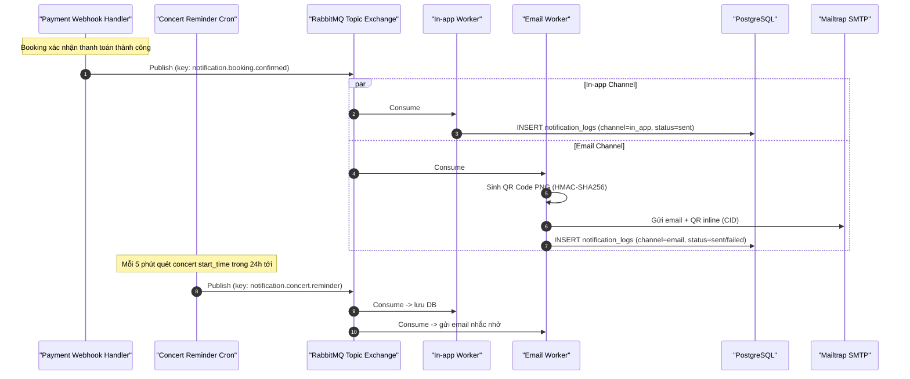

### Concert Reminder Scheduler

- **Cron:** `@Cron('*/5 * * * *')` — quét mỗi 5 phút.
- **Query:** `SELECT * FROM concerts WHERE start_time BETWEEN NOW() + INTERVAL '23 hours 55 minutes' AND NOW() + INTERVAL '24 hours 5 minutes' AND reminder_sent = false`
- **Hành động:** Lấy danh sách user có vé `paid` → publish message → cập nhật `reminder_sent = true`.
- **Giới hạn:** Chỉ gửi đúng 1 lần. Không gửi lại khi concert đổi giờ (ngoài phạm vi đồ án).

### Email (Nodemailer + Mailtrap)

- **Thư viện:** Nodemailer với cấu hình SMTP qua biến môi trường (`SMTP_HOST`, `SMTP_PORT`, `SMTP_USER`, `SMTP_PASS`).
- **Mock Server:** Mailtrap (SMTP sandbox) cho môi trường Dev — email được gửi thật nhưng không tới inbox thật, chỉ hiển thị trên dashboard Mailtrap.
- **E-ticket Email:** Chứa thông tin concert + chi tiết vé + **QR code nhúng inline** dưới dạng ảnh PNG (CID attachment).
- **Chuyển production:** Chỉ cần đổi biến môi trường SMTP sang SendGrid/SES — code không thay đổi.

### Bảng `notification_logs` (BIGSERIAL PK)

Dùng **BIGSERIAL** (8 bytes) thay vì UUID v7 (16 bytes) cho bảng log — tiết kiệm 50% dung lượng PK trong bảng có volume ghi cao. Các FK liên kết vẫn dùng UUID v7 để đồng bộ schema chính.

---

## Nhập danh sách khách mời VIP từ CSV (VIP Guest List Import)

### Các phương án cân nhắc

| #   | Phương án                                               | Mô tả                                                                                                                                                                               |
| --- | ------------------------------------------------------- | ----------------------------------------------------------------------------------------------------------------------------------------------------------------------------------- |
| A   | **Xử lý đồng bộ (Synchronous)**                         | Đọc file CSV, kiểm tra dữ liệu và lưu vào database trực tiếp trong luồng request của API.                                                                                           |
| B   | **Xử lý bất đồng bộ qua Hàng đợi (Asynchronous Queue)** | API nhận file CSV, lưu tạm và đẩy một job `import_vip_guests` vào RabbitMQ, trả về HTTP 202 Accepted ngay lập tức cho Admin. Một Worker riêng biệt sẽ tiêu thụ và xử lý file ở nền. |

### Đánh giá

| Tiêu chí                  | Xử lý đồng bộ                                                             | Xử lý bất đồng bộ                                                                 |
| ------------------------- | ------------------------------------------------------------------------- | --------------------------------------------------------------------------------- |
| Trải nghiệm người dùng    | ❌ Chờ đợi lâu (đặc biệt khi file >1000 dòng), nguy cơ timeout HTTP.      | ✅ Nhận phản hồi "Đã tiếp nhận" tức thì, có thể theo dõi tiến trình ở nền.        |
| Độ ổn định của API thread | ❌ Blocking API thread. Nếu nhiều Admin import cùng lúc có thể gây nghẽn. | ✅ Non-blocking, giải phóng tài nguyên API nhanh chóng.                           |
| Khả năng chịu lỗi         | ❌ Lỗi giữa chừng khó phục hồi, dễ gây trùng lặp nếu import lại.          | ✅ Dễ dàng quản lý transaction và retry từng phần thông qua hàng đợi.             |
| Độ phức tạp triển khai    | ✅ Thấp (chỉ cần viết controller + service thông thường).                 | ⚠️ Trung bình (yêu cầu cấu hình queue, worker và cơ chế theo dõi trạng thái job). |

### Chốt giải pháp: Phương án B — Xử lý bất đồng bộ qua RabbitMQ

**Lý do:**

- Tệp CSV danh sách VIP có thể chứa hàng nghìn dòng. Xử lý đồng bộ sẽ block request thread và dễ bị timeout.
- Tận dụng hạ tầng RabbitMQ sẵn có để xử lý bất đồng bộ mà không cần cài đặt thêm công cụ mới.
- Cách ly tải trọng: Xử lý file nặng không làm ảnh hưởng đến hiệu năng các API đặt vé của khán giả.

### Quy trình xử lý chi tiết

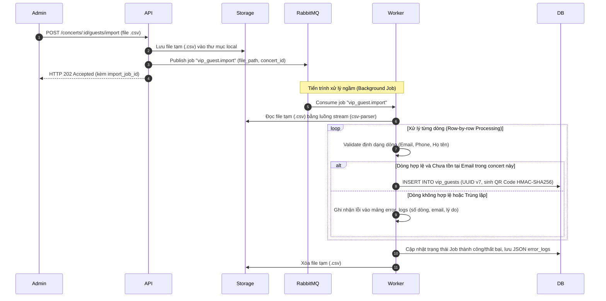

- **Row-by-row Validation (Validate từng dòng):** Sử dụng thư viện `csv-parser` để đọc dạng stream. Mỗi dòng được validate qua `class-validator` (hoặc Zod schema). Dòng bị lỗi sẽ bị bỏ qua và đẩy vào mảng báo lỗi, không làm dừng toàn bộ file (Graceful Recovery).
- **Deduplication (Chống trùng lặp):** Sử dụng DB constraint `UNIQUE (concert_id, email)` trong bảng `vip_guests` hoặc kiểm tra trước trong service để bỏ qua các dòng trùng lặp mà không gây crash transaction.
- **Tạo mã QR VIP:** Tương tự như vé thường, mỗi khách mời VIP sẽ được sinh một mã QR chứa payload có chữ ký số HMAC-SHA256 với `SERVER_SECRET` và được gửi qua Email sau khi import thành công.

---

## Tích hợp AI Artist Bio (AI Artist Bio Integration)

### Các phương án cân nhắc

| #   | Phương án                                         | Mô tả                                                                                                                                                                       |
| --- | ------------------------------------------------- | --------------------------------------------------------------------------------------------------------------------------------------------------------------------------- |
| A   | **Gọi API Google Gemini trực tiếp (Synchronous)** | API nhận file PDF, parse text, gửi thẳng sang Gemini API và chờ nhận kết quả để trả về cho Client.                                                                          |
| B   | **Xử lý bất đồng bộ (Asynchronous Worker)**       | Upload PDF -> Parse text -> Lưu DB -> Đẩy task `generate_bio` vào RabbitMQ. Worker gọi Gemini API và cập nhật kết quả vào DB. Admin nhận thông báo hoặc polling trạng thái. |

### Đánh giá

| Tiêu chí                       | Gọi API trực tiếp                                                                  | Xử lý bất đồng bộ                                                                     |
| ------------------------------ | ---------------------------------------------------------------------------------- | ------------------------------------------------------------------------------------- |
| Độ trễ phản hồi (Latency)      | ❌ Rất cao (Google Gemini API có thể mất 5 - 15 giây để sinh văn bản).             | ✅ Rất thấp (trả về trạng thái "đang xử lý" ngay lập tức).                            |
| Khả năng chịu lỗi (Resilience) | ❌ Lỗi kết nối hoặc API rate limit từ Gemini sẽ làm hỏng toàn bộ request của user. | ✅ Tự động retry thông qua hàng đợi nếu API ngoài bị lỗi tạm thời hoặc rate limit.    |
| Độ phức tạp triển khai         | ✅ Thấp (chỉ cần gọi API trong controller).                                        | ⚠️ Trung bình (cần quản lý trạng thái xử lý trong DB và cơ chế thông báo cho client). |

### Chốt giải pháp: Phương án B — Xử lý bất đồng bộ qua RabbitMQ

**Lý do:** Google Gemini API là một dịch vụ bên thứ ba có độ trễ lớn và không đảm bảo SLA 100%. Gọi trực tiếp từ API Gateway sẽ chiếm dụng connection và thread của NestJS quá lâu. Xử lý qua hàng đợi RabbitMQ giúp cô lập lỗi mạng, tự động retry khi gặp lỗi rate limit và mang lại trải nghiệm mượt mà cho Admin.

### Quy trình xử lý chi tiết

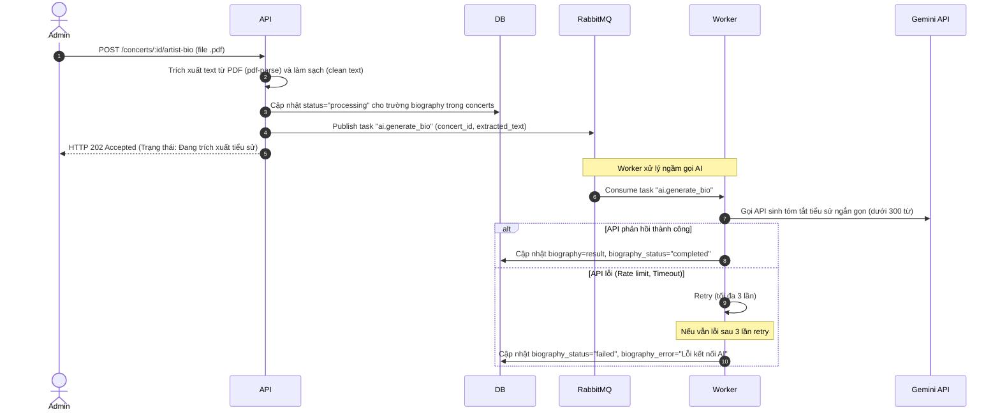

- **Trích xuất văn bản (Text Extraction):** Sử dụng thư viện `pdf-parse` để đọc file PDF buffer và lấy ra phần text thô (raw text). Thực hiện chuẩn hóa text (loại bỏ ký tự đặc biệt thừa, khoảng trắng thừa) trước khi gửi đi để tối ưu token.
- **Tích hợp Google Gemini AI:** Dùng thư viện `@google/generative-ai`. Sử dụng model `gemini-1.5-flash` (hoặc `gemini-pro`) với system prompt được định nghĩa sẵn để định hình phong cách tóm tắt tiểu sử nghệ sĩ (ngắn gọn, chuyên nghiệp, hấp dẫn cho sự kiện âm nhạc, độ dài dưới 300 từ).
- **Cơ chế Retry - Fallback:** Cấu hình RabbitMQ retry logic với exponential backoff để đối phó với lỗi Rate Limit (`429 Too Many Requests`) của Gemini API.

---

## Các quyết định kỹ thuật quan trọng (ADR)

### ADR-01: Chọn Message Broker — RabbitMQ vs Kafka vs BullMQ

| Tiêu chí                                | RabbitMQ                             | Apache Kafka                        | BullMQ (Redis)                    |
| --------------------------------------- | ------------------------------------ | ----------------------------------- | --------------------------------- |
| Mô hình                                 | Message Queue (push-based)           | Event Log (pull-based, append-only) | Job Queue (Redis-based)           |
| Đảm bảo thứ tự                          | ✅ Trong 1 queue                     | ✅ Trong 1 partition                | ✅ Trong 1 queue                  |
| Acknowledgement                         | ✅ Per-message ack                   | ⚠️ Offset-based commit              | ✅ Per-job ack                    |
| Dead Letter Queue                       | ✅ Native support                    | ❌ Phải tự build                    | ✅ Có (failed jobs)               |
| Độ phức tạp hạ tầng                     | ⚠️ Cần RabbitMQ server               | ❌ Cần Kafka + ZooKeeper/KRaft      | ✅ Dùng chung Redis đã có         |
| Routing linh hoạt (Topic/Direct/Fanout) | ✅ Rất mạnh                          | ❌ Chỉ có topic-based               | ❌ Không có exchange concept      |
| Phù hợp bài toán                        | ✅ Task queue + notification routing | ⚠️ Quá nặng cho đồ án               | ⚠️ Thiếu routing cho notification |

**Chốt:** **RabbitMQ**. Cung cấp routing linh hoạt nhất (Topic Exchange cho notification, Direct Queue cho booking). Kafka quá nặng về hạ tầng cho đồ án. BullMQ thiếu exchange/routing concept cần thiết cho notification architecture mở rộng.

---

### ADR-02: Chọn Rate Limiter Storage — Redis vs In-Memory

| Tiêu chí                    | Redis                   | In-Memory (Node.js Map) |
| --------------------------- | ----------------------- | ----------------------- |
| Chia sẻ giữa nhiều instance | ✅ Centralized          | ❌ Per-instance counter |
| Persist qua restart         | ✅ Có (AOF)             | ❌ Mất khi restart      |
| Latency                     | ⚠️ ~0.5ms (network hop) | ✅ ~0.01ms              |
| Phù hợp scale-out           | ✅                      | ❌                      |

**Chốt:** **Redis**. Dù hiện tại chỉ có 1 NestJS instance, Redis đảm bảo tính đúng đắn khi scale-out sau này và đã có sẵn trong stack (dùng chung cho cache + inventory).

---

### ADR-03: Chọn ORM — TypeORM vs Prisma vs Knex

| Tiêu chí                 | TypeORM                     | Prisma                           | Knex                |
| ------------------------ | --------------------------- | -------------------------------- | ------------------- |
| Tích hợp NestJS          | ✅ `@nestjs/typeorm` native | ⚠️ Cần wrapper                   | ❌ Cần tự integrate |
| Migration tool           | ✅ Có                       | ✅ Có (tốt hơn)                  | ✅ Có               |
| Type safety              | ⚠️ Decorator-based, runtime | ✅ Generated types, compile-time | ❌ Yếu              |
| Decorator/Entity pattern | ✅ Class-based Entity       | ❌ Schema file riêng             | ❌ Không có         |
| Raw query khi cần        | ✅ QueryBuilder + raw       | ✅ $queryRaw                     | ✅ Native           |
| Community + Tài liệu     | ✅ Lớn                      | ✅ Lớn, tài liệu tốt             | ⚠️ Trung bình       |

**Chốt:** **TypeORM**. TypeORM có ưu thế tích hợp native với NestJS qua decorator.

---

### ADR-04: Notification — In-app (DB) + Email (Mock SMTP) vs Push Notification (FCM)

| Tiêu chí             | In-app + Email                  | Push Notification (FCM)               |
| -------------------- | ------------------------------- | ------------------------------------- |
| Cần cấu hình hạ tầng | ✅ Chỉ Mailtrap (free)          | ❌ Firebase project + service account |
| Hoạt động trên Web   | ✅ In-app hiển thị trên web     | ⚠️ Cần Service Worker                 |
| Yêu cầu user consent | ❌ Không                        | ✅ Cần permission popup               |
| Dễ demo/kiểm thử     | ✅ Mailtrap dashboard           | ❌ Cần thiết bị thật/emulator         |
| Mở rộng sau          | ✅ Thêm FCM worker vào exchange | —                                     |

**Chốt:** **In-app (DB) + Email (Nodemailer + Mailtrap)**. Bỏ qua FCM để giảm tải cấu hình hạ tầng. Kiến trúc Topic Exchange cho phép thêm FCM worker sau mà không sửa code hiện tại.

---

## Risks / Trade-offs

| #   | Rủi ro                                       | Mô tả chi tiết                                                                                                | Phương án giảm thiểu                                                                                                                                                                                                                                                                   |
| --- | -------------------------------------------- | ------------------------------------------------------------------------------------------------------------- | -------------------------------------------------------------------------------------------------------------------------------------------------------------------------------------------------------------------------------------------------------------------------------------- |
| R1  | **Mất đồng bộ Redis ↔ PostgreSQL**           | Redis restart hoặc lỗi mạng sau Lua Script thành công nhưng trước khi message vào RabbitMQ → tồn kho bị lệch. | Reconciliation Job chạy mỗi 15 phút, đối soát bookings (pending/paid) trong PostgreSQL với inventory trên Redis. Redis bật AOF persistence.                                                                                                                                            |
| R2  | **RabbitMQ sập → đơn hàng chậm**             | Message bị mất hoặc tắc nghẽn trong hàng đợi.                                                                 | Durable queues + persistent messages. Sử dụng Dead Letter Queue (DLQ) hứng message lỗi.                                                                                                                                                                                                |
| R3  | **Đơn hàng "ma" chiếm tồn kho**              | Khách giữ chỗ (Redis trừ tồn kho) nhưng không thực hiện thanh toán.                                           | Đơn pending tự động hết hạn sau 10 phút. Scheduler quét mỗi phút → hủy đơn + chạy Lua Script hồi kho trên Redis.                                                                                                                                                                       |
| R4  | **Email gửi thất bại**                       | SMTP timeout hoặc lỗi kết nối cổng Mailtrap.                                                                  | Email gửi async qua RabbitMQ worker. Failure → `notification_logs.status = failed` để retry sau. Không ảnh hưởng luồng booking/payment.                                                                                                                                                |
| R5  | **Cổng thanh toán không ổn định**            | VNPAY/MoMo timeout, trả lỗi 5xx, hoặc webhook gọi lặp nhiều lần.                                              | Circuit Breaker (opossum) tự động cắt mạch khi lỗi >50%. Idempotency Key trên Redis (TTL 24h) chống xử lý trùng.                                                                                                                                                                       |
| R6  | **Soát vé thất bại khi mất kết nối mạng**    | Nhân viên soát vé không thể kiểm tra vé real-time tại SVĐ do nghẽn sóng.                                      | Dữ liệu soát vé được tải sẵn xuống SQLite nội bộ trên Mobile App. Nhân viên soát vé quét và kiểm tra chữ ký HMAC-SHA256 ngoại tuyến. Khi có mạng trở lại, Mobile App sẽ gửi log check-in ngoại tuyến thông qua API `/checkin/sync` để ghi nhận và đối soát trùng lặp ở database chính. |
| R7  | **Tệp CSV VIP bị lỗi hoặc chứa dữ liệu bẩn** | File CSV lớn của đối tác có thể chứa dữ liệu sai định dạng hoặc trùng lặp, gây crash luồng import.            | Sử dụng Background Job để xử lý bất đồng bộ từng dòng (row-by-row validation). Ghi nhận log dòng lỗi riêng biệt để admin sửa đổi thủ công sau, đảm bảo các dòng hợp lệ vẫn được nhập thành công.                                                                                       |
| R8  | **Gemini AI API bị timeout hoặc rate limit** | Khi admin tạo bio nghệ sĩ, dịch vụ bên thứ ba bị gián đoạn làm treo hoặc lỗi trang admin.                     | Đẩy tác vụ gọi AI vào RabbitMQ xử lý bất đồng bộ. Áp dụng cơ chế Circuit Breaker và retry với exponential backoff. Cập nhật trạng thái bio vào DB để admin theo dõi quá trình sinh bio ở giao diện.                                                                                    |
