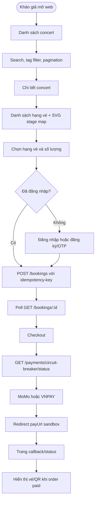

# Web Application Proposal — Current Audience Frontend

Tài liệu này mô tả Web Client dành cho khán giả theo implementation hiện tại của TicketBox. Frontend dùng React + Vite + TypeScript, CSS vanilla, `react-router-dom`, REST API client dùng JWT và Socket.IO cho realtime notification khi người dùng đã đăng nhập.

---

## 1. User Flow



---

## 2. Page Specifications

### 2.1. Concert List

Route: `/` và `/concerts`

- Gọi `GET /concerts?status=active&page=&limit=&search=&tag=`.
- Hiển thị hero, poster, tên concert, địa điểm, ngày giờ và tags.
- Có search, tag filter, pagination.
- Có loading, empty, error và retry state.

### 2.2. Concert Detail & Ticket Selection

Route: `/concerts/:id`

Frontend gọi song song:

- `GET /concerts/:id`
- `GET /concerts/:id/ticket-types`
- `GET /concerts/:id/stagemap`

UI hiển thị:

- Thông tin concert, poster, địa điểm, thời gian, mô tả.
- Biography/artist summary nếu backend trả về.
- SVG stage map nếu có `svgStageMap`.
- Sidebar chọn hạng vé, giá, tồn kho, `maxPerUser`.
- Tự refresh `GET /concerts/:id/ticket-types` mỗi 10 giây khi đang ở trang detail để tồn kho gần realtime hơn.
- Nếu SVG không map được zone, người dùng vẫn chọn hạng vé bằng danh sách bên phải.

### 2.3. Booking Processing

Khi bấm đặt vé:

- Nếu chưa đăng nhập, chuyển `/login`.
- Nếu đã đăng nhập, sinh `crypto.randomUUID()`.
- Gửi `POST /bookings` với header `idempotency-key`.
- Body:

```json
{
  "concertId": "concert-id",
  "items": [
    { "ticketTypeId": "ticket-type-id", "quantity": 2 }
  ]
}
```

Sau khi nhận `orderId`, frontend chuyển sang `/bookings/processing/:orderId` và poll `GET /bookings/:id` mỗi 2 giây. Khi order chuyển `pending`, frontend chuyển sang checkout.

### 2.4. Checkout & Payment

Route: `/checkout/:orderId`

- Gọi `GET /bookings/:orderId`.
- Gọi `GET /payments/circuit-breaker/status`.
- Tính countdown giữ vé theo `createdAt + 10 phút`.
- Disable MoMo/VNPAY nếu circuit breaker tương ứng là `OPEN`.
- Mỗi lần tạo payment sinh `idempotency-key` riêng.
- MoMo: `POST /payments/momo`
- VNPAY: `POST /payments/vnpay`
- Nếu response có `payUrl`, redirect sang gateway sandbox.

Trong phase hiện tại không có Pay Later vì backend chưa có endpoint thật cho luồng này.

### 2.5. Payment Callback / Order Status

Route: `/payment-callback/:orderId`

- Poll `GET /bookings/:orderId` tối đa khoảng 30 giây.
- Nếu order `paid`, hiển thị vé và QR từ `tickets`.
- Nếu order `expired` hoặc `cancelled`, hiển thị trạng thái thất bại/hết hạn.
- Nếu vẫn `pending` sau thời gian chờ, hiển thị trạng thái đang chờ xác nhận.

### 2.6. Auth

Route: `/login`

UI hiện hỗ trợ:

- Login: `POST /auth/login`
- Register: `POST /auth/register`
- Verify OTP: `POST /auth/verify-otp`
- Resend OTP: `POST /auth/resend-otp`
- Forgot password: `POST /auth/forgot-password`
- Verify reset OTP: `POST /auth/verify-reset-otp`
- Reset password: `POST /auth/reset-password`
- Bootstrap session: `GET /auth/me`
- Refresh token tự động: `POST /auth/refresh`

---

## 3. Technical Decisions

### 3.1. SVG stage map

**Options:**

- Option A: Chọn phân khu bằng SVG phẳng.
- Option B: Chọn từng ghế cụ thể.

**Decision:** Chọn Option A.

**Lý do:** Backend quản lý tồn kho theo ticket type, không quản lý từng ghế. SVG phẳng giảm conflict ở client và phù hợp Redis Lua inventory hiện có.

### 3.2. Inventory freshness

**Options:**

- Option A: Load tồn kho một lần khi mở detail.
- Option B: Poll `GET /concerts/:id/ticket-types` khi người dùng ở trang detail.
- Option C: Realtime inventory qua WebSocket riêng.

**Decision:** Chọn Option B cho phase hiện tại.

**Lý do:** Backend đã có endpoint đọc ticket types/available quantity. Poll 10 giây đơn giản, ổn định khi demo và không cần thêm event backend mới.

### 3.3. Idempotency key

**Options:**

- Option A: Chỉ disable nút sau khi click.
- Option B: Disable nút + gửi header `idempotency-key`.

**Decision:** Chọn Option B.

**Lý do:** UI disable chỉ chống double click cục bộ, còn idempotency key chống retry/reload/network duplicate ở tầng backend/Redis.

### 3.4. Payment gateway failure

**Options:**

- Option A: Để user click gateway rồi chờ lỗi.
- Option B: Gọi circuit breaker status trước và disable gateway đang `OPEN`.

**Decision:** Chọn Option B.

**Lý do:** Backend đã expose `GET /payments/circuit-breaker/status`; frontend dùng dữ liệu này để giảm lỗi thao tác và hướng user sang gateway còn hoạt động.

---

## 4. API Contracts Used By Audience UI

### Concerts

- `GET /concerts?status=active&page=&limit=&search=&tag=`
- `GET /concerts/:id`
- `GET /concerts/:id/ticket-types`
- `GET /concerts/:id/stagemap`

### Booking

- `POST /bookings`
- `GET /bookings/:id`

Required booking header:

```http
idempotency-key: <uuid-v4>
```

### Payment

- `GET /payments/circuit-breaker/status`
- `POST /payments/momo`
- `POST /payments/vnpay`
- `GET /payments/:orderId`

Required payment header:

```http
idempotency-key: <uuid-v4>
```

### Auth

- `POST /auth/register`
- `POST /auth/verify-otp`
- `POST /auth/login`
- `POST /auth/refresh`
- `POST /auth/logout`
- `POST /auth/resend-otp`
- `POST /auth/forgot-password`
- `POST /auth/verify-reset-otp`
- `POST /auth/reset-password`
- `GET /auth/me`

---

## 5. Runtime Configuration

Frontend defaults:

- `VITE_API_BASE_URL=/api/v1`
- `VITE_SOCKET_URL=http://localhost:3000`

When running Vite directly without Nginx proxy, set:

```env
VITE_API_BASE_URL=http://localhost:3000/api/v1
VITE_SOCKET_URL=http://localhost:3000
```

