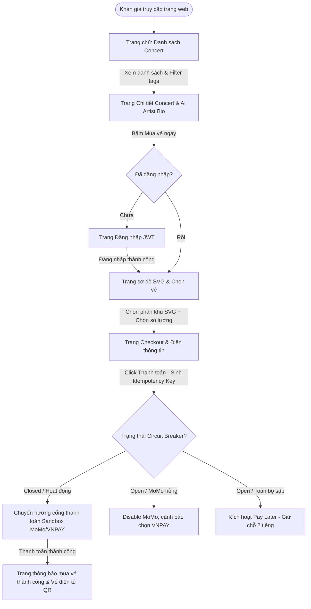

# Web Application Proposal — Audience Frontend Spec

Tài liệu này đặc tả kiến trúc giao diện, luồng người dùng (User Flow) và các giải pháp kỹ thuật phía Web Client dành cho Khán giả (Audience) của hệ thống bán vé chịu tải cao **TicketBox**.

---

## 1. Tổng quan & Luồng đi của Người dùng (User Flow)

Hệ thống Web Client dành cho khán giả được xây dựng bằng **React.js (Vite + TypeScript)** kết hợp với **CSS Vanilla** để đảm bảo hiệu năng tối đa, tối ưu hóa CSS bundle size và tốc độ render tức thì dưới môi trường lượng truy cập cực lớn.

### Sơ đồ luồng đi của Khán giả (User Flow Diagram)



---

## 2. Đặc tả các trang giao diện (Page Specifications)

### Trang 1: Trang chủ / Danh sách Concert
*   **Chức năng chính:** Hiển thị các sự kiện ca nhạc đang mở bán hoặc sắp diễn ra.
*   **Chi tiết giao diện:**
    *   Thanh tìm kiếm theo từ khóa tên Concert hoặc địa điểm tổ chức.
    *   Bộ lọc nhanh bằng các thẻ phong cách âm nhạc (`tags` - ví dụ: `#Ballad`, `#Rap`, `#Rock`...) được tự động cập nhật từ cơ sở dữ liệu (sinh ra bởi AI).
    *   Danh sách concert hiển thị dưới dạng Grid Card bao gồm: Poster, Tên Concert, Ngày giờ diễn ra, Địa điểm và Khoảng giá vé (từ giá thấp nhất đến cao nhất).
*   **Hiệu năng Client:** Sử dụng chiến lược **Cache-aside** (gọi API lấy danh sách đã được cache 24h trên Redis ở backend) giúp trang chủ load dưới 50ms, chống chịu hoàn toàn khi hàng chục nghìn người F5 cùng lúc.

### Trang 2: Chi tiết Concert & Hồ sơ Nghệ sĩ (AI Artist Bio)
*   **Chức năng chính:** Cung cấp đầy đủ thông tin về sự kiện và nghệ sĩ tham gia.
*   **Chi tiết giao diện:**
    *   Thông tin lịch trình, sơ đồ phân khu tĩnh, danh mục giá vé và các quyền lợi đi kèm cho từng hạng vé.
    *   **Artist Profile Section:** Hiển thị tiểu sử và phong cách nghệ thuật của nghệ sĩ do Gemini AI tự động sinh ra (`summary` trong database).
    *   **Xử lý Skeleton Loading:** 
        *   Khi Ban tổ chức vừa upload PDF presskit và AI backend đang tiến hành đọc/phân tích thô (`processing_bio = true`), UI Client sẽ hiển thị các khối **Skeleton Loading** (hộp màu xám nhấp nháy chuyển động) tại vùng giới thiệu nghệ sĩ.
        *   Tránh hiện tượng khoảng trắng hoặc nội dung rỗng, giúp giao diện chuyên nghiệp hơn.
        *   Nhận tín hiệu WebSocket (`Socket.IO`) hoặc Polling từ backend khi xử lý AI hoàn tất để tự động render văn bản thô vừa tạo mà không yêu cầu khán giả tải lại trang.

### Trang 3: Sơ đồ chỗ ngồi tương tác (Interactive SVG Seating Map)
Đây là màn hình lõi quyết định tốc độ mua vé và trải nghiệm người dùng.

*   **Các phương án thiết kế sơ đồ (Options):**
    *   *Option A (Chọn Phân Khu):* Vẽ sơ đồ tổng thể dạng file SVG phẳng. Khách hàng click trực tiếp vào một phân khu (ví dụ: SVIP A, VIP B, GA...). Hệ thống gọi API hiển thị số lượng vé còn trống theo thời gian thực và cho phép chọn số lượng vé (tối đa 2 vé/concert/tài khoản). Số ghế cụ thể sẽ được backend tự động cấp phát tuần tự khi tạo hóa đơn thành công.
    *   *Option B (Chọn Từng Vị Trí Ghế cụ thể):* Hiển thị lưới sơ đồ chi tiết từng ghế trống (chấm xanh/đỏ). Khách hàng click chọn từng tọa độ ghế.
*   **Đánh giá:**
    *   *Ưu điểm Option A:* Load cực nhanh, giảm thiểu hoàn toàn xung đột tranh giành chỗ ngồi (Race Condition) ở RAM/Database, phù hợp 100% với schema DB hiện tại (chỉ lưu tồn kho theo phân hạng vé).
    *   *Nhược điểm Option A:* Khách hàng không được chọn đúng vị trí ghế ngồi theo sở thích (gần lối đi, giữa hàng...).
    *   *Ưu điểm Option B:* Chọn được chính xác vị trí ngồi ưa thích.
    *   *Nhược điểm Option B:* Gây treo/sập hệ thống khi hàng nghìn người cùng click vào 1 ghế VIP trong mili-giây đầu tiên, đòi hỏi schema DB rất phức tạp để quản lý trạng thái từng ghế.
*   **Quyết định (Decision):** **Chọn Option A (Chọn Phân Khu bằng sơ đồ phẳng SVG).**
*   **Lý do phù hợp với hệ thống TicketBox:** Giúp triệt tiêu race condition ở client và backend, tăng tốc độ xử lý của Redis Lua Script lên RAM dưới tải cực cao (1.000 requests/giây).

#### Chi tiết giao diện & Tương tác:
*   **Bên trái:** Khung SVG render sơ đồ phân khu. Mỗi phân khu là một thẻ `<path>` hoặc `<polygon>` có `id` tương ứng với `ticket_type_id`.
    *   *Hiệu ứng hover:* Phân khu sáng lên, hiển thị tooltip tên hạng vé và giá vé.
    *   *Sự kiện click:* Kích hoạt highlight phân khu (thêm viền neon) và đồng bộ thông tin sang Sidebar bên phải.
*   **Bên phải (Sidebar đặt vé):** 
    *   Hiển thị tên phân khu được chọn, giá vé và số lượng vé còn lại trong kho (Real-time Ticket Inventory được fetch liên tục qua API đọc từ cache Redis).
    *   Dropdown chọn số lượng vé (giới hạn từ 1 đến số vé tối đa được phép mua của tài khoản, max = 2).
    *   Nút "Tiếp tục" chuyển sang trang điền thông tin thanh toán.

### Trang 4: Trang Checkout & Thanh toán
*   **Chức năng chính:** Điền thông tin cá nhân và tiến hành thanh toán trực tuyến.
*   **Chi tiết giao diện:**
    *   Bộ đếm ngược **Holding Ticket Timer** hiển thị nổi bật ở góc trang.
    *   Form điền thông tin người sở hữu vé (Họ tên, Email, Số điện thoại).
    *   Khu vực lựa chọn phương thức thanh toán: Ví điện tử MoMo, Cổng VNPAY.
    *   Nút bấm "Thanh toán".

---

## 3. Đặc tả các giải pháp kỹ thuật Front-end (Technical Specs)

### 3.1. Countdown Timer (Bộ đếm ngược giữ chỗ tạm thời)
*   **Các phương án thiết kế (Options):**
    *   *Option A (Chỉ chạy đếm ngược ở Client):* Client sử dụng hàm `setInterval` của JavaScript để tự đếm ngược 10 phút.
    *   *Option B (Đồng bộ thời gian đếm ngược từ Server):* Khi tạo đơn hàng thành công, Server trả về mốc thời gian hết hạn chính xác `paymentExpiredAt` (UTC timestamp). Client sử dụng mốc này để tính khoảng thời gian còn lại so với đồng hồ hệ thống.
*   **Đánh giá:**
    *   *Ưu điểm Option A:* Cài đặt đơn giản, không cần gọi API đồng bộ.
    *   *Nhược điểm Option A:* Lệch giờ nếu Client load lại trang (đếm ngược sẽ bắt đầu lại từ đầu ở UI nhưng backend đã hết hạn).
    *   *Ưu điểm Option B:* Đảm bảo tính nhất quán tuyệt đối, dù người dùng load lại trang hoặc chuyển đổi thiết bị thì thời gian còn lại vẫn phản ánh đúng mốc thời gian thực tế ở backend.
    *   *Nhược điểm Option B:* Phụ thuộc vào tính chính xác của đồng hồ máy client (có thể lệch múi giờ).
*   **Quyết định (Decision):** **Chọn Option B** kết hợp định kỳ đối soát với Server.
*   **Lý do phù hợp với hệ thống TicketBox:** Đơn hàng giữ chỗ tạm thời (Hold Ticket) chỉ tồn tại đúng 10 phút trên Redis. Việc đồng bộ mốc thời gian thực giúp ngăn chặn tình trạng khách hàng đã bị hủy vé ở backend nhưng giao diện vẫn hiển thị còn thời gian thanh toán.

---

### 3.2. Idempotency Key (Chống trừ tiền 2 lần)
*   **Các phương án thiết kế (Options):**
    *   *Option A (Chặn thao tác click ở UI):* Khi click thanh toán, nút bấm sẽ bị disable để ngăn click đúp.
    *   *Option B (Gửi kèm Idempotency-Key ở Header):* Mỗi giao dịch đi kèm một mã UUID v4 duy nhất do client sinh ra ở header. Backend dùng Redis để lưu trữ key này trong 24h và chặn các request trùng lặp.
*   **Đánh giá:**
    *   *Ưu điểm Option A:* Rất dễ thực hiện ở frontend.
    *   *Nhược điểm Option A:* Không chống được trường hợp người dùng reload trang và bấm lại, hoặc request bị timeout mạng khiến client tự động gửi lại (retry logic của HTTP client).
    *   *Ưu điểm Option B:* Bảo vệ giao dịch ở cả tầng mạng và database. Dù client có gửi lại request do lag mạng thì backend cũng chỉ xử lý thanh toán đúng 1 lần.
    *   *Nhược điểm Option B:* Client cần lưu trữ trạng thái key cẩn thận và reset khi bắt đầu giao dịch mới.
*   **Quyết định (Decision):** **Chọn Option B (kết hợp cả Option A ở UI để tối ưu trải nghiệm).**
*   **Lý do phù hợp với hệ thống TicketBox:** Trong hệ thống chịu tải cao, việc trừ tiền 2 lần là lỗi nghiêm trọng nhất. Idempotency Key lưu trên Redis là tiêu chuẩn vàng để bảo vệ các cổng thanh toán (MoMo/VNPAY) khỏi các yêu cầu thanh toán trùng lặp.

---

### 3.3. Xử lý khi cổng thanh toán sập (Circuit Breaker & Graceful Degradation)
*   **Các phương án thiết kế (Options):**
    *   *Option A (Chờ timeout mặc định):* Khi cổng thanh toán gặp lỗi hoặc timeout, client chờ 30 giây rồi hiển thị thông báo lỗi chung chung.
    *   *Option B (Hạ cấp trải nghiệm động - Graceful Degradation):* Web App nhận diện trạng thái Circuit Breaker (Open/Closed) từ API Backend để chủ động disable các cổng lỗi, hiển thị cảnh báo cho người dùng và kích hoạt luồng thanh toán dự phòng (Pay Later).
*   **Đánh giá:**
    *   *Ưu điểm Option A:* Không cần quản lý trạng thái động ở Client.
    *   *Nhược điểm Option A:* Gây nghẽn luồng xử lý của backend, người dùng phải chờ đợi quá lâu dẫn đến việc bỏ giỏ hàng.
    *   *Ưu điểm Option B:* Phản hồi lập tức trên UI, hướng khán giả thanh toán qua kênh an toàn, giảm tải cho server.
    *   *Nhược điểm Option B:* Đòi hỏi logic UI phức tạp hơn.
*   **Quyết định (Decision):** **Chọn Option B.**
*   **Lý do phù hợp với hệ thống TicketBox:** Cổng thanh toán sandbox của MoMo/VNPAY rất dễ gặp sự cố khi mở bán vé concert lớn. Việc hạ cấp dịch vụ sang "Pay Later" giúp giữ chân khách hàng và duy trì hoạt động bán vé ổn định.

---

## 4. API Request/Response đặc tả cho Client (Audience Pages)

### 4.1. API Lấy thông tin sơ đồ và giá vé Concert
*   **Endpoint:** `GET /api/v1/concerts/:id`
*   **Response Body (Định dạng JSON):**
```json
{
  "id": "018f2b84-1d8f-7f3c-8a21-998877665544",
  "title": "Concert Anh Trai Say Hi D-9",
  "description": "Đêm nhạc đặc biệt quy tụ dàn anh trai tại Vạn Phúc City...",
  "location": "Khu đô thị Vạn Phúc, TP. Thủ Đức, TP.HCM",
  "posterUrl": "https://res.cloudinary.com/ticketbox/image/upload/v1717231200/sayhi_poster.jpg",
  "startTime": "2026-04-18T12:00:00.000Z",
  "endTime": "2026-04-18T23:00:00.000Z",
  "status": "active",
  "summary": "Dàn nghệ sĩ Anh Trai Say Hi gồm 30 ca sĩ tài năng...", // AI Artist Bio
  "processingBio": false, // Trạng thái AI đang chạy
  "tags": ["pop", "rap", "dance"],
  "svgStageMap": "<svg viewBox='0 0 800 600'>...</svg>", // File SVG phẳng render ở Client
  "ticketTypes": [
    {
      "id": "018f2b84-2a1c-7f3d-8b43-112233445566",
      "name": "SVIP",
      "price": 5000000.00,
      "totalQuantity": 500,
      "availableQuantity": 120, // Số vé còn lại real-time
      "maxPerUser": 2
    },
    {
      "id": "018f2b84-2b2d-7f3e-8c54-77889900aabb",
      "name": "VIP",
      "price": 4000000.00,
      "totalQuantity": 1000,
      "availableQuantity": 450,
      "maxPerUser": 2
    },
    {
      "id": "018f2b84-2c3e-7f3f-8d65-ccddeeff0011",
      "name": "GA",
      "price": 1000000.00,
      "totalQuantity": 5000,
      "availableQuantity": 2300,
      "maxPerUser": 2
    }
  ]
}
```

### 4.2. API Tạo đơn hàng giữ chỗ tạm thời (Bắt đầu Checkout)
*   **Endpoint:** `POST /api/v1/orders/hold`
*   **Request Body:**
```json
{
  "concertId": "018f2b84-1d8f-7f3c-8a21-998877665544",
  "items": [
    {
      "ticketTypeId": "018f2b84-2a1c-7f3d-8b43-112233445566",
      "quantity": 2
    }
  ]
}
```
*   **Response Body:**
```json
{
  "orderId": "018f2b84-3c4f-7f4a-9a12-aabbccddeeff",
  "totalAmount": 10000000.00,
  "status": "PENDING",
  "paymentExpiredAt": "2026-06-16T04:44:18.000Z" // Mốc 10 phút để Client chạy bộ đếm ngược
}
```

### 4.3. API Thanh toán (Checkout Payment)
*   **Endpoint:** `POST /api/v1/payments/checkout`
*   **Request Headers:**
    *   `Authorization: Bearer <jwt_token>`
    *   `Idempotency-Key: 438f292c-5b8c-4a3d-9e12-334455667788` (Client tự sinh UUID v4)
*   **Request Body:**
```json
{
  "orderId": "018f2b84-3c4f-7f4a-9a12-aabbccddeeff",
  "paymentGateway": "MOMO", // Hoặc "VNPAY", "PAY_LATER"
  "buyerName": "Nguyễn Văn A",
  "buyerEmail": "nguyenvana@gmail.com",
  "buyerPhone": "0901234567"
}
```
*   **Response Body (Trường hợp cổng thanh toán MoMo hoạt động bình thường):**
```json
{
  "paymentId": "018f2b84-4d5e-7f4b-9b23-112233445566",
  "status": "PROCESSING",
  "paymentUrl": "https://test-payment.momo.vn/pay/qr?token=...", // Client dùng để redirect sang cổng sandbox
  "paymentGateway": "MOMO"
}
```
*   **Response Body (Trường hợp MoMo sập, hệ thống kích hoạt chế độ Pay Later dự phòng):**
```json
{
  "paymentId": "018f2b84-4d5e-7f4b-9b23-112233445566",
  "status": "PROCESSING",
  "paymentGateway": "PAY_LATER",
  "paymentExpiredAt": "2026-06-16T06:34:18.000Z", // Gia hạn tự động lên 2 tiếng ở backend
  "bankAccount": "1234567890",
  "bankName": "Vietcombank",
  "accountHolder": "CONG TY TICKETBOX VIETNAM",
  "transferContent": "TBOX 3c4f7f4a" // Nội dung chuyển khoản chứa mã đơn hàng
}
```
