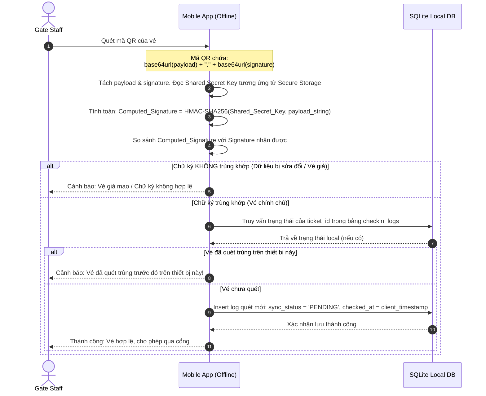
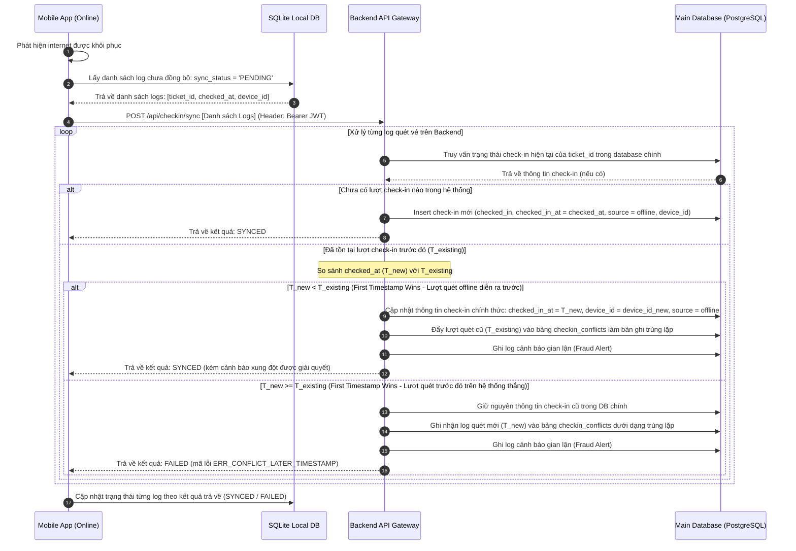

## Context

Hệ thống TicketBox cần triển khai ứng dụng di động dành riêng cho nhân viên soát vé tại cổng (`gate_staff`). Ứng dụng phải hoạt động tốt ngay cả khi kết nối mạng internet của địa điểm sự kiện không ổn định hoặc mất hoàn toàn (chế độ ngoại tuyến - offline).

Tài liệu này thiết kế giải pháp kỹ thuật đáp ứng các yêu cầu:
1. Xác thực vé ngoại tuyến không cần kết nối mạng qua mã hóa đối xứng HMAC-SHA256.
2. Lưu trữ dữ liệu soát vé local trên thiết bị di động (SQLite/Hive).
3. Luồng dữ liệu và kịch bản đồng bộ giải quyết xung đột theo nguyên tắc "First Timestamp Wins".
4. API đăng nhập và lưu trữ JWT/Shared Secret Key an toàn trên thiết bị di động.

---

## Goals / Non-Goals

### Goals
- Cho phép gate_staff thực hiện kiểm tra tính chính chủ và soát vé nhanh (< 1 giây) khi hoàn toàn ngoại tuyến.
- Đảm bảo tính toàn vẹn và không thể làm giả vé thông qua chữ ký mã hóa đối xứng HMAC-SHA256.
- Thiết lập cơ chế đồng bộ tự động/thủ công khi có mạng trở lại, xử lý chính xác các trường hợp gian lận/quét trùng vé theo thời gian thực tế quét.
- Bảo mật thông tin xác thực của gate_staff, Shared Secret Key và dữ liệu lưu trữ local.

### Non-Goals
- Đồng bộ thời gian thực giữa các thiết bị khi cả hai đều đang ngoại tuyến (không có mạng LAN nội bộ giữa các máy quét).
- Mua vé, thanh toán hoặc đổi vé trên ứng dụng soát vé di động.

---

## Decisions

### 1. Luồng dữ liệu và Đồng bộ (Data Flow & Sync)

#### Luồng Soát Vé Ngoại Tuyến (Offline Check-in Flow)
Luồng này thực hiện toàn bộ dưới môi trường local của ứng dụng di động (không cần kết nối internet):



#### Luồng Đồng Bộ & Xử Lý Xung Đột (Sync & Conflict Resolution Flow)
Luồng này tự động kích hoạt hoặc kích hoạt thủ công khi phát hiện thiết bị di động khôi phục kết nối mạng internet:



---

### 2. Giải pháp Xác thực mã hóa đối xứng HMAC-SHA256 (Offline Verification)

- **Thuật toán áp dụng:** **HMAC-SHA256** (Hash-based Message Authentication Code sử dụng SHA-256).
- **Cấu trúc sinh chữ ký từ Server (Backend):**
  - Khi một vé được phát hành thành công, Server chuẩn hóa payload JSON của vé:
    `Payload_JSON = {"id":"tkt-9b1deb4d-3b7d-4bad-9bdd-2b0d7b3dcb6d","cid":"con-7c9e9b4d-3b7d-4bad-9bdd-2b0d7b3dcb6d","type":"VIP","name":"Nguyen Van A"}`
  - Server sử dụng khóa bí mật dùng chung của Concert (`Shared_Secret_Key`) để ký số:
    `Signature = HEX(HMAC-SHA256(Shared_Secret_Key, Payload_JSON))`
  - Ghép chuỗi QR Code: `Mã QR = Base64URL(Payload_JSON) + "." + Base64URL(Signature)`
- **Quy trình App tự băm đối chiếu ngoại tuyến:**
  1. Camera của App quét mã QR và thu được chuỗi.
  2. App phân tách chuỗi bằng ký tự `.` để có 2 phần: `Payload_Enc` và `Signature_Enc`.
  3. App giải mã Base64URL `Payload_Enc` để khôi phục cấu trúc JSON, trích xuất mã concert (`cid`).
  4. App tìm kiếm `Shared_Secret_Key` tương ứng của Concert từ hệ thống lưu trữ bảo mật cục bộ.
  5. App tự chạy phép băm: `Computed_Sig = HEX(HMAC-SHA256(Shared_Secret_Key, Payload_Decoded_String))`
  6. App chuyển đổi và so sánh chuỗi `Computed_Sig` với `Signature_Enc` (đã giải mã). Nếu khớp, vé được xác nhận chính chủ và không bị thay đổi nội dung.
- **Phương án lưu trữ Shared Secret Key an toàn trên thiết bị:**
  - **Android:** Khóa đối xứng được lưu trong **EncryptedSharedPreferences** hoặc mã hóa bằng **AES-GCM** và lưu vào Database riêng tư của ứng dụng, với khóa mã hóa AES được sinh và quản lý bởi phần cứng **Android Keystore System**.
  - **iOS:** Khóa đối xứng được lưu trữ trực tiếp vào phân vùng phần cứng an toàn **Keychain Services** của iOS.
  - Khóa bí mật chỉ được chuyển từ server về ứng dụng qua giao thức HTTPS bảo mật tại thời điểm gate_staff đăng nhập thành công và lập tức lưu vào Keychain/Keystore. Không ghi ra file thô, không ghi log hệ thống.

---

### 3. Cấu trúc cơ sở dữ liệu cục bộ (SQLite Schema)

Thiết kế SQLite lưu trữ cục bộ trên thiết bị di động phục vụ soát vé ngoại tuyến:

```sql
-- Bảng chứa thông tin danh sách vé được cache (để hiển thị thông tin khi quét thành công)
CREATE TABLE tickets (
    id TEXT PRIMARY KEY,
    concert_id TEXT NOT NULL,
    ticket_type TEXT NOT NULL,
    owner_name TEXT,
    status TEXT NOT NULL DEFAULT 'pending'
);
CREATE INDEX idx_tickets_concert_id ON tickets(concert_id);

-- Bảng lưu log quét soát vé ngoại tuyến (Bắt buộc)
CREATE TABLE checkin_logs (
    id TEXT PRIMARY KEY, -- Client-side UUID
    ticket_id TEXT NOT NULL,
    device_id TEXT NOT NULL,
    checked_at INTEGER NOT NULL, -- Timestamp quét vé local (milliseconds since epoch)
    sync_status TEXT NOT NULL CHECK(sync_status IN ('PENDING', 'SYNCED', 'FAILED')) DEFAULT 'PENDING',
    sync_error TEXT,
    FOREIGN KEY(ticket_id) REFERENCES tickets(id)
);
-- Tạo các index phục vụ truy vấn tối ưu ngoại tuyến và đồng bộ nhanh
CREATE INDEX idx_checkin_logs_sync_status ON checkin_logs(sync_status);
CREATE INDEX idx_checkin_logs_ticket_id ON checkin_logs(ticket_id);
```

---

### 4. Kịch bản Xử lý Xung đột Đồng bộ (First Timestamp Wins)

#### Thuật toán xử lý trên Server
Khi nhận danh sách log từ API `POST /api/checkin/sync`, Server thực thi thuật toán giải quyết xung đột cho từng log quét vé như sau:

```
Nhận log quét vé mới (ticket_id, checked_at_new, device_id_new)
|
+---> Truy vấn trạng thái check-in hiện tại của ticket_id trong bảng chính:
      |
      +---> Trường hợp 1: Chưa có lượt check-in nào trong DB chính
      |     |
      |     +---> Ghi nhận check-in: status = 'checked_in', checked_in_at = checked_at_new
      |           Trả về kết quả: SYNCED
      |
      +---> Trường hợp 2: Đã tồn tại lượt check-in trước đó với timestamp (checked_in_at_existing)
            |
            +---> So sánh: checked_at_new < checked_in_at_existing
                  |
                  +---> ĐÚNG (Log offline diễn ra TRƯỚC lượt quét hiện tại):
                  |     1. Cập nhật DB chính thức: checked_in_at = checked_at_new, device_id = device_id_new, source = 'offline'
                  |     2. Đẩy lượt quét cũ (checked_in_at_existing) vào bảng checkin_conflicts với mã trạng thái 'overwritten_by_offline'
                  |     3. Ghi nhận cảnh báo gian lận lên admin dashboard
                  |     Trả về kết quả: SYNCED
                  |
                  +---> SAI (Log offline diễn ra SAU lượt quét hiện tại):
                        1. Giữ nguyên DB chính thức (không thay đổi)
                        2. Thêm log mới (checked_at_new) vào bảng checkin_conflicts với mã lỗi 'ERR_CONFLICT_LATER_TIMESTAMP'
                        3. Ghi nhận cảnh báo gian lận lên admin dashboard
                        Trả về kết quả: FAILED (mã lỗi ERR_CONFLICT_LATER_TIMESTAMP)
```

#### Đặc tả API và cấu trúc JSON trả về khi đồng bộ
API trả về mã phản hồi `200 OK` kèm theo danh sách kết quả xử lý chi tiết từng phần tử để client cập nhật trạng thái local DB tương ứng:

```json
{
  "status": "partial_success",
  "synced_count": 1,
  "failed_count": 1,
  "results": [
    {
      "ticket_id": "tkt-9b1deb4d-3b7d-4bad-9bdd-2b0d7b3dcb6d",
      "sync_status": "SYNCED",
      "message": "Đồng bộ thành công."
    },
    {
      "ticket_id": "tkt-01234567-89ab-cdef-0123-456789abcdef",
      "sync_status": "FAILED",
      "error_code": "ERR_CONFLICT_LATER_TIMESTAMP",
      "message": "Xung đột soát vé: Đã tồn tại lượt quét hợp lệ diễn ra trước đó trên thiết bị khác.",
      "details": {
        "checked_at_new": 1718208210000,
        "checked_at_existing": 1718208200000
      }
    }
  ]
}
```

---

## Risks / Trade-offs

- **[Risk] Lệch thời gian hệ thống trên thiết bị di động (Client Clock Drift):**
  - *Mô tả:* Nhân viên soát vé chỉnh giờ trên điện thoại cố tình lùi lại để "chiến thắng" trong quy tắc First Timestamp Wins.
  - *Mitigation:* Ứng dụng di động khi đăng nhập và đồng bộ SHALL tính toán độ lệch thời gian giữa client và server (NTP sync or server time handshake) và điều chỉnh lại timestamp lưu trữ local bằng công thức `real_timestamp = client_timestamp - drift`. Ngoài ra, hệ thống sẽ chặn các log có `client_timestamp` quá xa so với thời gian hiện tại (ví dụ: lệch quá 24h).
- **[Risk] Lộ Shared Secret Key (Khóa đối xứng):**
  - *Mô tả:* Do sử dụng mã hóa đối xứng, nếu kẻ tấn công lấy được Shared Secret Key từ thiết bị, họ có thể tự tạo chữ ký hợp lệ để vượt qua kiểm tra offline.
  - *Mitigation:* 
    1. Key chỉ lưu trong Keystore/Keychain bảo mật phần cứng, không lưu trong SQLite thô.
    2. Mỗi Concert có một Shared Secret Key riêng biệt; rò rỉ key của Concert này không làm ảnh hưởng đến các Concert khác.
    3. Thực hiện Secure Wipe: Hủy bỏ key khỏi thiết bị và xóa toàn bộ Local DB ngay khi gate_staff đăng xuất hoặc sự kiện kết thúc.
- **[Risk] Nghẽn tải (Out of Memory / Timeout) do tải lượng lớn dữ liệu vé:**
  - *Mô tả:* Một sự kiện lớn có thể có tới 80.000 vé. Tải toàn bộ danh sách một lần trong quá trình đăng nhập có thể gây crash (OOM) trên Mobile App hoặc timeout.
  - *Mitigation:* Sử dụng chiến lược phân trang (Pagination) hoặc chia nhỏ khối (Chunking) tại API tải danh sách vé. App di động sẽ tuần tự gọi API để tải và insert từng khối dữ liệu vào SQLite Local DB cho đến khi hoàn tất.
